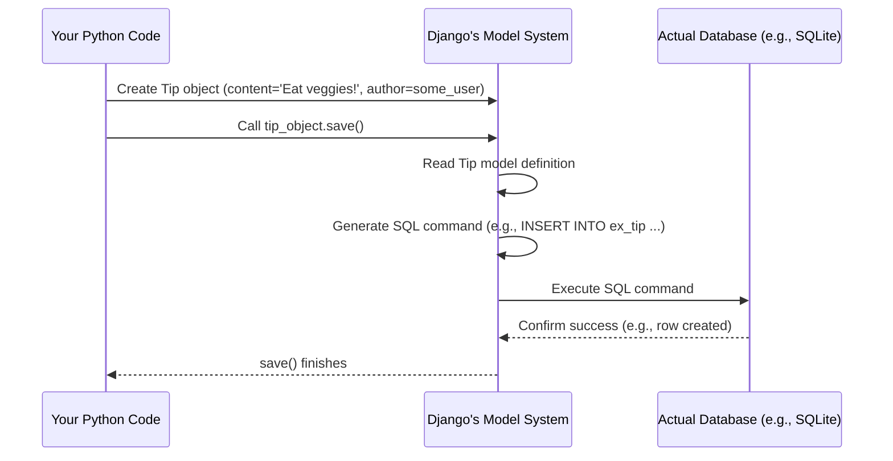

# Chapter 1: Data Models (Tip & User)

Welcome to the Life-Pro-Tips project tutorial! We're going to build a simple web application where users can share and vote on helpful life tips. This is the very first step, and we'll start with the foundations.

Imagine you want to build a house. Before you start hammering nails, you need a blueprint, right? The blueprint tells you where the walls go, how many rooms there are, and what each room is for.

In web applications, we need a similar kind of blueprint for our *data*. We need to decide *what* information we want to store and *how* it should be structured. This is where **Data Models** come in.

**Use Case:** Think about a single "Life Pro Tip". What information do we need to store about it?
*   The actual text of the tip.
*   Who wrote the tip?
*   When was it posted?
*   How many people liked it (upvoted)?
*   How many people disliked it (downvoted)?

Similarly, for a *user* of our site:
*   What's their username?
*   What's their password (stored securely, of course!)?
*   Maybe a score based on how helpful their tips are (we'll call this "reputation").

Data Models are like these blueprints for our database. They tell our application (built with a framework called Django) exactly how to organize and store information about Tips and Users.

## Our Blueprints: `CustomUser` and `Tip`

In our project, we have two main blueprints (models) defined in the file `ex/models.py`:

1.  `CustomUser`: Represents a user of our website.
2.  `Tip`: Represents a single life pro tip submitted by a user.

Let's look at them one by one.

### 1. The `CustomUser` Model

Django comes with a built-in User model, but we want to add something extra: a `reputation` score. So, we create our own `CustomUser` model that *extends* Django's default user.

```python
# ex/models.py (Simplified Snippet)

from django.db import models
from django.contrib.auth.models import AbstractUser

# This class defines the structure for our users
class CustomUser(AbstractUser):
    # We add a field to store the user's reputation score
    # It's a whole number (Integer) and starts at 0 by default.
    reputation = models.IntegerField(default=0)

    # (Other methods related to reputation and permissions exist here,
    # but we'll cover them in detail later!)
    # def can_downvote(self): ...
    # def can_delete_tips(self): ...
    # def update_reputation(self): ...
```

*   **`class CustomUser(AbstractUser):`**: This line says we're creating a new blueprint called `CustomUser` based on Django's standard `AbstractUser`. This gives us standard user features like `username`, `password`, `email`, etc., for free!
*   **`reputation = models.IntegerField(default=0)`**: This is our custom addition. It defines a *field* called `reputation`.
    *   `models.IntegerField`: Tells Django this field will store whole numbers (integers).
    *   `default=0`: Means that when a new user is created, their reputation will automatically start at 0.

Think of this `CustomUser` model as defining the structure for a user's profile card in our application's filing cabinet (the database).

We also need to tell Django to actually *use* our `CustomUser` model instead of its default one. This is done in the settings file:

```python
# d07/settings.py (Relevant Snippet)

# This setting tells Django which model to use for users
AUTH_USER_MODEL = 'ex.CustomUser'
```

We'll dive deeper into settings in the [Project Configuration](08_project_configuration_.md) chapter.

### 2. The `Tip` Model

Now, let's look at the blueprint for the tips themselves.

```python
# ex/models.py (Simplified Snippet)

from django.db import models
from django.conf import settings # Used to refer to our CustomUser
from django.utils import timezone # Used for dates/times

# This class defines the structure for a Life Pro Tip
class Tip(models.Model):
    # The actual text content of the tip.
    content = models.TextField()

    # Who wrote this tip? This links to a CustomUser.
    # If the user is deleted, delete their tips too (CASCADE).
    author = models.ForeignKey(settings.AUTH_USER_MODEL, on_delete=models.CASCADE, related_name='tips')

    # When was the tip posted? Defaults to the time it's created.
    date = models.DateTimeField(default=timezone.now)

    # Who upvoted this tip? Links to potentially MANY CustomUsers.
    upvotes = models.ManyToManyField(settings.AUTH_USER_MODEL, related_name='upvoted_tips', blank=True)

    # Who downvoted this tip? Also links to potentially MANY CustomUsers.
    downvotes = models.ManyToManyField(settings.AUTH_USER_MODEL, related_name='downvoted_tips', blank=True)

    # (Other methods exist here, like __str__, save, delete,
    # which we'll explore more later!)
    # def __str__(self): ...
    # def save(self, *args, **kwargs): ...
    # def delete(self, *args, **kwargs): ...
```

Let's break down the fields:

*   **`content = models.TextField()`**: This field stores the text of the life pro tip. `TextField` is used for longer blocks of text.
*   **`author = models.ForeignKey(...)`**: This is a **relationship** field. It links a `Tip` to exactly *one* `CustomUser` (the author).
    *   `settings.AUTH_USER_MODEL`: This cleverly refers to whatever model we've set as our user model (which is `CustomUser`).
    *   `on_delete=models.CASCADE`: This rule means if the author (`CustomUser`) is deleted, all their associated `Tip`s should also be deleted automatically.
    *   `related_name='tips'`: This lets us easily find all tips written by a specific user later (e.g., `my_user.tips.all()`).
*   **`date = models.DateTimeField(default=timezone.now)`**: Stores the date and time the tip was created. `default=timezone.now` automatically sets it to the current time when a new tip is saved.
*   **`upvotes = models.ManyToManyField(...)`**: Another **relationship** field. This links a `Tip` to potentially *many* `CustomUser`s (those who upvoted it).
    *   `settings.AUTH_USER_MODEL`: Again, refers to our `CustomUser`.
    *   `related_name='upvoted_tips'`: Lets us easily find all tips a specific user has upvoted (e.g., `my_user.upvoted_tips.all()`).
    *   `blank=True`: Means a tip can exist even if nobody has upvoted it yet.
*   **`downvotes = models.ManyToManyField(...)`**: Similar to `upvotes`, but for users who downvoted the tip.

Think of the `Tip` model as the blueprint for an index card containing all the details about a specific life pro tip, including who wrote it and who voted on it.

## How Django Uses These Blueprints

Okay, we have these Python classes (`CustomUser`, `Tip`). How does this turn into something the database can understand?

When you work with Django models, you're mostly interacting with Python objects. Django's **Object-Relational Mapper (ORM)** is the magic layer that translates your Python code into database commands (like SQL) and vice-versa.

**Analogy:** Imagine you fill out a pre-printed "New Tip" form (creating a `Tip` object in Python). You hand this form to Django's ORM (the helpful office assistant). The ORM reads the form, understands the structure from the `Tip` model blueprint, and then neatly files the information into the correct drawers and folders in the database cabinet (inserts a row into the `tip` table in the database).

Here's a simplified view of what happens when you save a new Tip:



You write Python code like `new_tip = Tip(content="...", author=...)`, and then `new_tip.save()`. Behind the scenes, Django's ORM figures out the database table (`ex_tip`) and columns (`content`, `author_id`, `date`, etc.) based on your `Tip` model definition in `ex/models.py` and generates the necessary SQL code to interact with the database (like `INSERT`, `UPDATE`, `SELECT`). You don't usually need to write SQL yourself!

## Conclusion

We've just taken our first crucial step! We learned that **Data Models** are like blueprints (`CustomUser` and `Tip`) that define the structure of the information our application needs to store. They specify the fields (like `content`, `reputation`, `author`) and the relationships between different pieces of data (like a `Tip` having one `author` but potentially many `upvotes`).

Django uses these models with its ORM to manage storing and retrieving data from the database without us needing to write raw database commands directly.

Now that we have the blueprints for our data, how do we actually handle requests from users, like someone visiting a page to see tips or submitting a new tip? That's where our next topic comes in!

Let's move on to learn about how Django handles incoming web requests and decides what to do with them: [Chapter 2: Views (Request Handling Logic)](02_views__request_handling_logic__.md).

---

Generated by [AI Codebase Knowledge Builder](https://github.com/The-Pocket/Tutorial-Codebase-Knowledge)