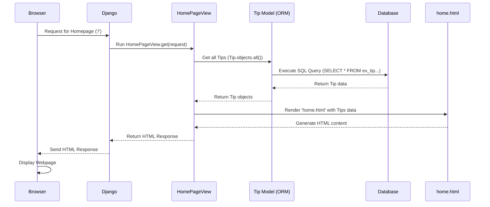

# Chapter 2: Views (Request Handling Logic)

Welcome back! In [Chapter 1: Data Models (Tip & User)](01_data_models__tip___user__.md), we created the blueprints for our data – the `CustomUser` and `Tip` models. These models define *what* information we store, like the text of a tip or a user's reputation.

But how does our application actually *do* anything? What happens when a user visits our website's homepage? How does the list of tips get displayed? How does the application handle a user clicking the "upvote" button?

This is where **Views** come in. They are the core logic units of our Django application.

**Analogy: The Chef in the Kitchen**

Think of your web application as a restaurant:

*   **User Request:** A customer placing an order (e.g., "I want to see the menu" or "I want to order the special").
*   **Models:** The ingredients stored in the pantry (like the `Tip` and `CustomUser` data we defined).
*   **Templates:** The final presentation of the dish on a plate (the HTML page the user sees).
*   **Views:** The **chef** in the kitchen! The chef takes the order (request), gets the necessary ingredients (models), prepares the dish according to the recipe (logic), and decides how it should be presented (template).

Views are responsible for:

1.  Receiving a user's request (e.g., asking for the homepage).
2.  Fetching necessary data from the [Data Models (Tip & User)](01_data_models__tip___user__.md) (e.g., getting all the latest tips).
3.  Performing actions if needed (e.g., processing a vote, saving a new tip).
4.  Choosing and preparing a response, often by selecting an HTML [Templates (HTML Rendering - Implicit)](04_templates__html_rendering___implicit__.md) and filling it with data.

## Our First View: Displaying Tips on the Homepage

Let's look at the most common task: showing the list of all Life Pro Tips on the homepage.

In Django, a view is typically a Python function or a method inside a Python class. It always takes at least one argument: an `HttpRequest` object (usually just called `request`), which contains information about the incoming request (like who the user is, what data they sent, etc.). The view must return an `HttpResponse` object, which is the response sent back to the user's browser (often generated by rendering an HTML template).

Here's a simplified look at how we might write a view function to display the tips:

```python
# (Simplified Concept - not the exact code from views.py yet)
from django.shortcuts import render # Helper to render HTML templates
from .models import Tip          # Import our Tip blueprint

def show_homepage(request):
    # 1. Get the ingredients (data): Fetch all Tip objects from the database
    all_tips = Tip.objects.all().order_by('-date') # Get all tips, newest first

    # 2. Prepare the dish (response): Render an HTML template named 'home.html'
    #    and pass the fetched tips to it.
    context = {'tips_list': all_tips} # Data to send to the template
    response = render(request, 'home.html', context)

    # 3. Serve the dish: Return the response
    return response
```

Let's break this down:

1.  **`def show_homepage(request):`**: Defines our view function. It takes the `request` object as input.
2.  **`all_tips = Tip.objects.all().order_by('-date')`**: This is where the view interacts with the [Data Models (Tip & User)](01_data_models__tip___user__.md). `Tip.objects.all()` uses Django's ORM (which we touched on in Chapter 1) to fetch *all* records matching the `Tip` blueprint from the database. `.order_by('-date')` sorts them so the newest tips appear first.
3.  **`context = {'tips_list': all_tips}`**: We create a dictionary called `context`. This is how we pass data from our view (the Python code) to our template (the HTML file). Here, we're making the list of tips available inside the template under the name `tips_list`.
4.  **`response = render(request, 'home.html', context)`**: The `render` function is a handy Django shortcut. It takes the `request`, the name of the template file (`home.html` - we'll learn more about these in [Chapter 4: Templates (HTML Rendering - Implicit)](04_templates__html_rendering___implicit__.md)), and the `context` dictionary. It generates the final HTML content by combining the template and the data.
5.  **`return response`**: The view returns the generated HTML response, which Django sends back to the user's browser.

## The Request-Response Cycle

So, what happens step-by-step when you type the website's address into your browser and hit Enter?

1.  Your **Browser** sends an HTTP Request to the web server where our Django app is running.
2.  **Django** receives the request. It looks at the requested URL (like `/` for the homepage) and, based on rules we'll define in [Chapter 3: URL Routing](03_url_routing_.md), decides which **View** function or class should handle it (e.g., our `show_homepage` view).
3.  The **View** (`show_homepage`) runs.
4.  The View asks the **Model** (`Tip`) via the ORM to fetch data from the **Database**.
5.  The Database sends the data back to the View.
6.  The View uses the `render` function, passing the data to the specified **Template** (`home.html`).
7.  The `render` function combines the template and data to generate the final HTML **Response**.
8.  The View returns this Response to Django.
9.  Django sends the HTTP Response back to your **Browser**.
10. Your Browser reads the HTML and displays the webpage, showing the list of tips!

Here's a diagram illustrating this flow:



## Our Project's Views (`ex/views.py`)

In our `Life-Pro-Tips` project, the views are defined in the file `ex/views.py`. Instead of simple functions, we often use **Class-Based Views** (like `HomePageView`). These are Python classes that group related request-handling logic together. For example, one method might handle viewing the page (`GET` requests), and another might handle submitting data from that page (`POST` requests).

Let's look at the actual `HomePageView` from our project:

```python
# ex/views.py (HomePageView Snippet)

from django.shortcuts import render, redirect
from django.views import View
from .models import Tip
from .forms import TipForm # We'll cover forms later

class HomePageView(View):
    def get(self, request):
        # Fetch all Tip objects, ordered by date (newest first)
        tips = Tip.objects.all().order_by('-date')

        # Prepare the form for submitting new tips (only if logged in)
        # More on Forms in Chapter 5 and Auth in Chapter 6
        form = TipForm() if request.user.is_authenticated else None

        # Render the 'home.html' template, passing tips and the form
        return render(request, 'home.html', {
            'tips': tips, # Make tips available as 'tips' in the template
            'form': form, # Make form available as 'form'
            # Other context details...
        })

    # This method handles when a user submits the 'New Tip' form
    def post(self, request):
        # Only allow logged-in users to post
        if request.user.is_authenticated:
            form = TipForm(request.POST) # Create form with submitted data
            if form.is_valid(): # Check if the data is okay
                tip = form.save(commit=False) # Create Tip object but don't save yet
                tip.author = request.user    # Set the author to the logged-in user
                tip.save()                   # Now save the Tip to the database
        return redirect('home') # Send the user back to the homepage
```

*   **`class HomePageView(View):`**: Defines a class named `HomePageView` that inherits from Django's base `View` class.
*   **`def get(self, request):`**: This method handles HTTP `GET` requests – typically used when a user just visits a page to view content.
    *   `tips = Tip.objects.all().order_by('-date')`: Fetches all tips, same as our simplified example.
    *   `form = TipForm() ...`: Creates an instance of `TipForm` (which we'll cover in [Chapter 5: Forms (Tip Submission)](05_forms__tip_submission_.md)). This form will be used to display the input box for adding new tips, but only if the user is logged in ([Chapter 6: User Authentication & Permissions](06_user_authentication___permissions_.md)).
    *   `render(request, 'home.html', {...})`: Renders the `home.html` template, passing the `tips` list and the `form` object to it.
*   **`def post(self, request):`**: This method handles HTTP `POST` requests – typically used when a user submits data (like filling out a form).
    *   It checks if the user is logged in.
    *   It processes the submitted form data using `TipForm(request.POST)`.
    *   If the form is valid, it creates a new `Tip` object, sets the `author` to the current user (`request.user`), and saves it to the database.
    *   `return redirect('home')`: Instead of rendering a template, it sends a redirect instruction back to the browser, telling it to load the homepage again (so the user sees the newly added tip).

## Views for Actions: Voting and Deleting

Our `ex/views.py` file contains other views too, many of which perform specific actions:

*   `upvote_tip(request, tip_id)`: Handles clicking the upvote button for a specific tip.
*   `downvote_tip(request, tip_id)`: Handles clicking the downvote button.
*   `delete_tip(request, tip_id)`: Handles deleting a tip (if the user has permission).
*   `LoginView`, `RegistrationView`, `LogoutView`: Handle user login, registration, and logout processes ([Chapter 6: User Authentication & Permissions](06_user_authentication___permissions_.md)).

Let's look at a tiny piece of `upvote_tip`:

```python
# ex/views.py (upvote_tip Snippet)

from django.shortcuts import redirect, get_object_or_404
from django.contrib.auth.decorators import login_required # Ensures user is logged in
from .models import Tip

@login_required # Decorator: only logged-in users can run this view
def upvote_tip(request, tip_id):
    # 1. Find the specific Tip object using its ID
    tip = get_object_or_404(Tip, id=tip_id)

    # (Logic to add/remove user from upvotes/downvotes...)
    # Example: Add the current user to the tip's upvoters
    if request.user not in tip.upvotes.all():
         tip.upvotes.add(request.user) # Modify the model data!

    # (Update author's reputation - more in Chapter 7)
    # tip.author.update_reputation()

    # 3. Redirect the user back to the homepage
    return redirect('home')
```

This view does the following:

1.  Uses `@login_required` to make sure only logged-in users can access it.
2.  Gets the specific `Tip` object the user wants to upvote using its `tip_id` (which will be part of the URL, as we'll see in the next chapter). `get_object_or_404` is a helper that either finds the Tip or shows a "Not Found" error page.
3.  It then modifies the data associated with that `Tip` object (e.g., adding the current user, `request.user`, to the `upvotes` list). This directly changes the data linked through our [Data Models (Tip & User)](01_data_models__tip___user__.md).
4.  Finally, it uses `redirect('home')` to send the user back to the homepage, where they will see the updated vote count.

## Conclusion

We've learned that **Views** are the workhorses of our Django application. They act like the chefs, taking incoming user requests, interacting with the **Models** (ingredients) to fetch or modify data, and deciding what **Response** to send back, often by rendering an HTML **Template** (the final dish).

We saw how the `HomePageView` fetches all tips and prepares them for display, and how other views like `upvote_tip` handle specific actions by modifying model data and then redirecting the user.

But how does Django know *which* view to call when a user visits a specific URL like `/` or `/tip/5/upvote/`? That's the job of the URL router.

Let's move on to the next chapter to understand how URLs are mapped to views: [Chapter 3: URL Routing](03_url_routing_.md).

---

Generated by [AI Codebase Knowledge Builder](https://github.com/The-Pocket/Tutorial-Codebase-Knowledge)