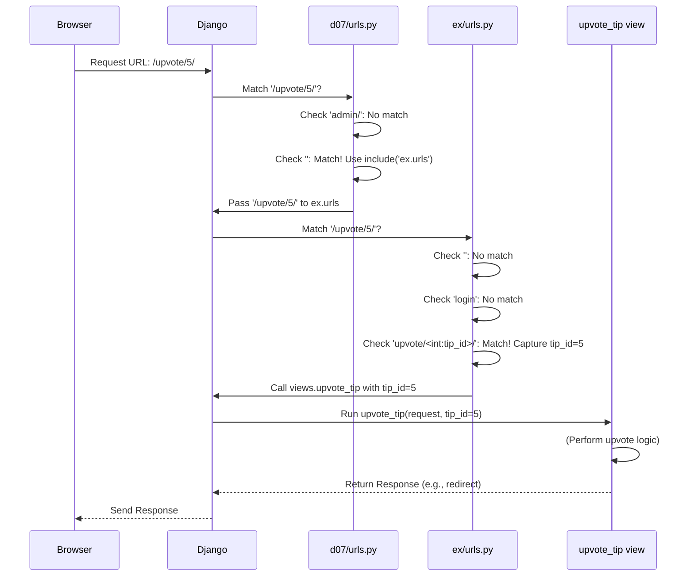

# Chapter 3: URL Routing

Welcome back! In [Chapter 2: Views (Request Handling Logic)](02_views__request_handling_logic__.md), we learned that **Views** are like the chefs in our application's kitchen. They contain the logic to handle user requests, fetch data from our [Data Models (Tip & User)](01_data_models__tip___user__.md), and prepare a response (often by rendering an HTML page).

But imagine you walk into a large office building with many different departments (our views). How do you know where to go? You need a directory or a receptionist to guide you to the right office based on your destination (e.g., "Accounts Payable" or "Customer Support").

Our web application needs a similar system. When a user types a web address (a URL like `www.our-lpt-site.com/` or `www.our-lpt-site.com/login` or `www.our-lpt-site.com/upvote/123/`) into their browser, how does Django know *which* specific view function (like `HomePageView` or `upvote_tip`) should handle that request?

This is where **URL Routing** comes in.

**Analogy: The Website's GPS or Receptionist**

Think of URL Routing as the GPS for your web application.

*   **User's Destination:** The URL they type in their browser (e.g., `/`, `/login`, `/upvote/5/`).
*   **Map:** A set of rules defined in our Django project (usually in files named `urls.py`).
*   **Specific Locations:** Our Python view functions/classes (like `HomePageView`, `LoginView`, `upvote_tip` from Chapter 2).
*   **URL Routing System:** Django's mechanism that looks at the user's destination (URL), consults the map (`urls.py`), and directs the request to the correct location (the corresponding view).

Without URL routing, Django wouldn't know what code to run for `/`, what to run for `/login`, or what to run when someone tries to upvote tip number 5 via `/upvote/5/`. It's the crucial link between the user's request URL and the Python code that handles it.

## How Django Handles URLs

Django looks for configuration files (typically named `urls.py`) that contain a list called `urlpatterns`. This list defines the "map" – it holds patterns that match URLs and specifies which view should be called for each pattern.

When a request comes in for a specific URL:

1.  Django starts at the root URL configuration of the project.
2.  It goes through the `urlpatterns` list in order.
3.  It tries to match the requested URL against each pattern.
4.  As soon as it finds a pattern that matches the beginning of the URL, it stops searching *that list* and takes action.
    *   If the pattern points directly to a view, Django calls that view.
    *   If the pattern points to *another* list of URL patterns (using `include()`, common for organizing apps), Django strips off the matched part of the URL and sends the remaining part to the included list for further matching.
5.  If it goes through the entire list and finds no match, Django will typically return a "Page Not Found" (404) error.

## Our Project's URL Files

In a typical Django project like `Life-Pro-Tips`, you'll find at least two `urls.py` files:

1.  **Project `urls.py` (`d07/urls.py`):** This is the main entry point for URL routing. It usually handles project-wide URLs (like the admin interface) and includes URL configurations from individual apps.
2.  **App `urls.py` (`ex/urls.py`):** Each Django "app" (a self-contained module of functionality, like our `ex` app for tips) often has its own `urls.py`. This file defines the URL patterns specific to that app.

Let's look at the project-level `urls.py`:

```python
# d07/urls.py (Simplified)

from django.contrib import admin
from django.urls import path, include # include is important here!

urlpatterns = [
    # Route for Django's built-in admin site
    path('admin/', admin.site.urls),

    # When the URL starts with NOTHING (i.e., the base URL '/'),
    # pass the rest of the URL handling to the 'ex.urls' file.
    path('', include('ex.urls')),
]
```

*   **`path('admin/', ...)`**: This pattern matches URLs starting with `/admin/` and directs them to Django's admin interface (which we won't cover in detail here).
*   **`path('', include('ex.urls'))`**: This is the key part for our app.
    *   `''`: This pattern matches an *empty* path relative to the site's base URL. So, it matches `/`, `/login`, `/upvote/5/`, etc. – essentially *any* URL not already matched by `/admin/`.
    *   `include('ex.urls')`: This tells Django: "If the URL matches this pattern (which is almost everything), don't handle it here directly. Instead, chop off the matched part (which is nothing in this case, `''`) and pass the *remaining* part of the URL to the patterns defined inside the `ex/urls.py` file."

Now, let's see what's inside the app-level `urls.py`:

```python
# ex/urls.py (Simplified Snippet)

from django.urls import path
from . import views # Import views from the current directory (ex app)
from .views import HomePageView, LoginView # Import specific views

urlpatterns = [
    # Map the empty path '' (relative to the base included path)
    # to the HomePageView. '.as_view()' is needed for class-based views.
    # 'name="home"' gives this URL pattern a unique name.
    path('', HomePageView.as_view(), name="home"),

    # Map '/login' to the LoginView
    path('login', LoginView.as_view(), name="login"),

    # Map '/upvote/<tip_id>/' to the upvote_tip function view.
    # <int:tip_id> captures an integer from the URL.
    path('upvote/<int:tip_id>/', views.upvote_tip, name='upvote_tip'),

    # Map '/downvote/<tip_id>/' to the downvote_tip function view.
    path('downvote/<int:tip_id>/', views.downvote_tip, name='downvote_tip'),

    # Map '/delete/<tip_id>/' to the delete_tip function view.
    path('delete/<int:tip_id>/', views.delete_tip, name='delete_tip'),

    # ... other paths for logout, registration ...
]
```

Let's break down a few patterns here:

1.  **`path('', HomePageView.as_view(), name='home')`**
    *   **`''`**: Matches the empty string. Since the project `urls.py` passed the *entire* URL here (because it matched `''`), this pattern specifically matches the root URL of our site (e.g., `www.our-lpt-site.com/`).
    *   **`HomePageView.as_view()`**: Specifies that requests matching this pattern should be handled by our `HomePageView` class from [Chapter 2: Views (Request Handling Logic)](02_views__request_handling_logic__.md). We use `.as_view()` because `HomePageView` is a class-based view.
    *   **`name='home'`**: Gives this URL route a unique name. This is super useful! It allows us to refer to this URL elsewhere in our code (like in templates or redirects) using the name `'home'` instead of hardcoding the path `''`. If we ever change the path later, we only need to update it here, not everywhere else we referred to it.

2.  **`path('login', LoginView.as_view(), name='login')`**
    *   **`'login'`**: Matches the URL `/login` (remember, the project `urls.py` sent the whole path here).
    *   **`LoginView.as_view()`**: Directs requests for `/login` to our `LoginView`.
    *   **`name='login'`**: Names this route `login`.

3.  **`path('upvote/<int:tip_id>/', views.upvote_tip, name='upvote_tip')`**
    *   **`'upvote/<int:tip_id>/'`**: This pattern is more interesting!
        *   It matches URLs that start with `/upvote/`, followed by something, and end with `/`.
        *   **`<int:tip_id>`**: This is a *path converter*. It tells Django to:
            *   Match one or more digits (`int`).
            *   Capture the matched digits and make them available to the view function as an argument named `tip_id`.
            *   So, this pattern would match `/upvote/5/`, `/upvote/123/`, etc., but *not* `/upvote/abc/` or `/upvote/`.
    *   **`views.upvote_tip`**: Specifies that the `upvote_tip` *function* (not a class this time) from our `views.py` should handle these requests.
    *   **`name='upvote_tip'`**: Names this route `upvote_tip`.

**How `<int:tip_id>` works:** When a user visits `/upvote/5/`, Django matches this pattern. It sees `<int:tip_id>` and extracts the number `5`. Then, it calls the `upvote_tip` view function like this: `views.upvote_tip(request, tip_id=5)`. Notice how the captured value (`5`) is passed as the `tip_id` argument to the view function we saw in Chapter 2! This is how the view knows *which* tip to upvote.

## The Routing Process: Step-by-Step

Let's trace what happens when a user visits `/upvote/5/`:

1.  **Browser:** Sends request for `/upvote/5/`.
2.  **Django:** Receives the request.
3.  **Django (Project `d07/urls.py`):**
    *   Checks `path('admin/', ...)`: No match.
    *   Checks `path('', include('ex.urls'))`: Matches! The pattern is `''`, which matches the start of `/upvote/5/`. It uses `include()`.
    *   Action: Strip the matched part (`''`) from `/upvote/5/` (leaving `/upvote/5/`) and pass it to `ex/urls.py` for matching.
4.  **Django (App `ex/urls.py`):** Receives `/upvote/5/` for matching.
    *   Checks `path('', ...)`: No match (`/upvote/5/` is not empty).
    *   Checks `path('login', ...)`: No match.
    *   Checks `path('upvote/<int:tip_id>/', views.upvote_tip, ...)`: Matches!
        *   `upvote/` matches `upvote/`.
        *   `<int:tip_id>` matches `5` and captures it as `tip_id = 5`.
        *   `/` matches `/`.
    *   Action: Stop searching. Call the view `views.upvote_tip`, passing the `request` object and the captured `tip_id=5`.
5.  **View (`views.upvote_tip`):** The function `upvote_tip(request, tip_id)` runs with `tip_id` set to `5`. It performs the upvote logic (as seen in Chapter 2) and likely returns a redirect response.
6.  **Django:** Sends the response (e.g., a redirect to the homepage) back to the browser.

Here's a diagram showing this flow:



## Conclusion

We've learned that **URL Routing** is Django's system for mapping specific web addresses (URLs) to the Python functions or classes ([Views (Request Handling Logic)](02_views__request_handling_logic__.md)) that handle them. It acts like a receptionist, using patterns defined in `urls.py` files (both at the project and app level) to direct incoming requests.

We saw how simple paths like `/` or `/login` are matched, and how more complex patterns like `/upvote/<int:tip_id>/` can capture parts of the URL and pass them as arguments to our views. We also learned about naming URL patterns (`name='...'`) for easier referencing.

Now we understand:
1.  How data is structured ([Chapter 1: Data Models (Tip & User)](01_data_models__tip___user__.md)).
2.  What code handles requests ([Chapter 2: Views (Request Handling Logic)](02_views__request_handling_logic__.md)).
3.  How URLs get directed to the right code (Chapter 3: URL Routing).

But what does the user actually *see*? Our views often need to send back HTML pages. How are those pages created and filled with data? That's the job of templates.

Let's move on to explore how Django generates the final HTML sent to the user: [Chapter 4: Templates (HTML Rendering - Implicit)](04_templates__html_rendering___implicit__.md).

---

Generated by [AI Codebase Knowledge Builder](https://github.com/The-Pocket/Tutorial-Codebase-Knowledge)