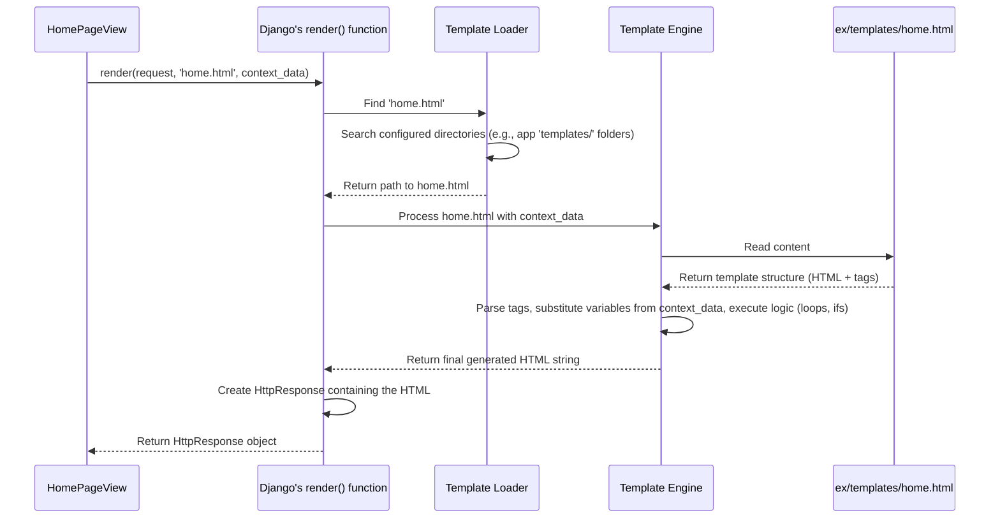

# Chapter 4: Templates (HTML Rendering - Implicit)

Welcome back! In [Chapter 3: URL Routing](03_url_routing_.md), we learned how Django acts like a receptionist, looking at the URL a user visits and directing the request to the correct Python code – our [Views (Request Handling Logic)](02_views__request_handling_logic__.md).

We know that views fetch data (like the list of tips) and decide what response to send back. Often, this response is a web page that the user sees in their browser. But how does the view actually *create* that web page with all the right information displayed nicely? We can't just send raw Python data like lists and objects to the browser; browsers understand HTML (HyperText Markup Language).

This is where **Templates** come into play.

**Use Case:** Imagine our `HomePageView` has fetched the 10 latest Life Pro Tips from the database. How do we present these 10 tips, along with the website's title, maybe a logged-in username, and a form to submit new tips, as a standard web page? We need a way to structure this information in HTML and insert the specific data (the actual tips, the username) into the right spots.

**Analogy: The Mail Merge Document**

Think about sending out personalized invitation letters. You don't write each letter from scratch. Instead, you create a **template** document (like in Microsoft Word or Google Docs). This template has the standard invitation text, but it also has special **placeholders** like `<<Guest Name>>` or `<<Event Date>>`.

Then, you use a list of guest names and dates (your data). The mail merge process takes the template, and for each guest, it fills in their specific name and the correct date into the placeholders, generating a personalized letter.

Django Templates work in a very similar way!

*   **Template:** An HTML file (`.html`) that defines the structure and look of a web page.
*   **Placeholders:** Special tags within the HTML template (`{{ variable }}` or ``) that mark where dynamic data should go.
*   **Data (Context):** A Python dictionary provided by the view, containing the actual information (like the list of tips, the current username) needed to fill the placeholders.
*   **Rendering Engine:** Django's system that takes the template and the data, performs the "mail merge," and generates the final HTML string to send to the browser.

## What are Templates in Django?

In Django, templates are typically text files, most often HTML files, that contain a mix of:

1.  **Static HTML:** The standard HTML tags (`<h1>`, `<p>`, `<div>`, etc.) that define the basic structure and layout of the page.
2.  **Template Language:** Special tags and filters that Django understands. These are the placeholders and logic controls.
    *   **Variables:** `{{ variable_name }}` - This tells Django to insert the value of `variable_name` from the data (context) provided by the view at this spot. Example: `<h1>Welcome, {{ username }}!</h1>`
    *   **Tags:** `` - These allow for more complex logic like loops, conditional statements, loading other template pieces, or generating URLs. Example: `` to loop through a list of tips.

## Implicit Rendering: The Hidden Files

Now, the chapter title mentions "Implicit". In our `Life-Pro-Tips` project structure and the code snippets we've focused on so far (like `ex/views.py`, `ex/models.py`), you won't *explicitly see* files like `home.html` or `login.html`.

**This doesn't mean they don't exist!** They are absolutely crucial. Django needs these `.html` files to know how to structure the final page.

The "implicit" part means that the way Django is configured in our project (using default settings), it automatically knows *where* to look for these template files (usually in a `templates` subdirectory within each app, like `ex/templates/home.html`). When our view code calls the `render()` function, Django finds and uses these template files behind the scenes.

## How Views Use Templates: The `render()` Function

Let's revisit our `HomePageView` from [Chapter 2: Views (Request Handling Logic)](02_views__request_handling_logic__.md):

```python
# ex/views.py (HomePageView Snippet)

from django.shortcuts import render # Import the render shortcut
# ... other imports ...
from .models import Tip
from .forms import TipForm

class HomePageView(View):
    def get(self, request):
        # 1. Fetch data from models
        tips = Tip.objects.all().order_by('-date')
        form = TipForm() if request.user.is_authenticated else None
        current_username = request.user.username if request.user.is_authenticated else request.defaultName

        # 2. Prepare the data (context) dictionary
        context = {
            'tips': tips,
            'form': form,
            'username': current_username
        }

        # 3. Call render() to generate the response
        #    - Pass the request
        #    - Specify the template file name ('home.html')
        #    - Provide the context dictionary
        return render(request, 'home.html', context)
    # ... post method ...
```

The key line is `return render(request, 'home.html', context)`. Let's break down `render()`'s arguments:

1.  `request`: The original HttpRequest object. Django needs this for various internal reasons.
2.  `'home.html'`: This is the **name** of the template file Django should find and use. Even though we don't see the file in our simplified view, Django knows where to look for it (based on settings).
3.  `context`: This is the Python **dictionary** containing all the dynamic data we want to make available inside the `home.html` template. The *keys* of the dictionary (e.g., `'tips'`, `'form'`, `'username'`) become the variable names we can use in the template with `{{ ... }}`.

## Conceptual Example: What `home.html` Might Look Like

Even though the file isn't shown, let's imagine a very simplified version of what `ex/templates/home.html` *could* contain to understand how the `context` data is used:

```html
<!-- Conceptual ex/templates/home.html -->
<!DOCTYPE html>
<html>
<head>
    <title>Life Pro Tips</title>
</head>
<body>
    <h1>Welcome, {{ username }}!</h1>

    <h2>Latest Tips:</h2>
    <ul>
         {# Loop through the 'tips' list from context #}
            <li>
                {{ tip.content }} {# Access the 'content' field of each tip object #}
                <br>
                <small>By: {{ tip.author.username }} | Upvotes: {{ tip.upvotes.count }}</small> {# Access related data #}
            </li>
         {# If the 'tips' list is empty #}
            <li>No tips have been submitted yet.</li>
        
    </ul>

     {# Check if the 'form' exists in the context (user is logged in) #}
        <h2>Submit a New Tip:</h2>
        <form method="post">
             {# Security tag - important for forms! #}
            {{ form.as_p }} {# Render the form fields - Chapter 5 will explain this #}
            <button type="submit">Submit Tip</button>
        </form>
    

</body>
</html>
```

See how the template uses:

*   `{{ username }}`: This will be replaced by the value associated with the key `'username'` in the `context` dictionary passed by the view (e.g., "GalacticVoyager" or "Guest").
*   ``: This starts a loop. It iterates over the list associated with the key `'tips'` in the `context`. Inside the loop, each item from the list is available as the variable `tip`.
*   `{{ tip.content }}`, `{{ tip.author.username }}`, `{{ tip.upvotes.count }}`: Inside the loop, we can access attributes or methods of the `tip` object (which is a `Tip` model instance from [Chapter 1: Data Models (Tip & User)](01_data_models__tip___user__.md)). Django allows accessing related model fields (like `tip.author.username`) using dot notation. `.count` is a way to get the number of related items (upvotes).
*   ``: This checks if the `form` variable exists and is not `None` in the context. If true, it displays the tip submission form.
*   `` and `{{ form.as_p }}`: These are related to handling [Forms (Tip Submission)](05_forms__tip_submission_.md) securely and displaying their fields, which we'll cover next.

When `render()` runs, it takes this template structure and the `context` data and produces the final HTML that gets sent to the user's browser.

## How `render()` Works Internally (Simplified)

What happens under the hood when `render(request, 'home.html', context)` is called?

1.  **Locate Template:** Django uses its template loaders (configured in `settings.py`) to find the `home.html` file. Because our `settings.py` likely has `'APP_DIRS': True` in the `TEMPLATES` setting, it will look inside a `templates` subdirectory within each installed app (so it finds `ex/templates/home.html`).
2.  **Parse Template:** Django reads the `home.html` file and parses its content, identifying the static HTML parts and the special template tags (`{{ ... }}` and ``).
3.  **Process Context:** It takes the `context` dictionary provided by the view.
4.  **Substitute Variables:** It goes through the parsed template and replaces all `{{ variable_name }}` occurrences with the corresponding values from the `context` dictionary. If you use `{{ tip.content }}`, it looks up `tip` in the context (which is defined by the `` loop) and then gets the `content` attribute of that object.
5.  **Execute Tags:** It executes the logic in the template tags. For example, `` sets up a loop, and `` performs a conditional check based on the `form` value in the context.
6.  **Generate HTML:** As it processes the template, it builds the final HTML string.
7.  **Create Response:** It takes the generated HTML string and wraps it in an `HttpResponse` object.
8.  **Return Response:** The `render()` function returns this `HttpResponse` object back to the view, which in turn returns it to Django to send to the browser.

Here’s a simplified diagram of the rendering process:



## Finding the Templates: `settings.py`

Where does Django know to look for templates like `home.html`? The configuration is in `d07/settings.py`:

```python
# d07/settings.py (TEMPLATES Snippet)

TEMPLATES = [
    {
        'BACKEND': 'django.template.backends.django.DjangoTemplates',
        'DIRS': [], # We could list project-wide template dirs here
        'APP_DIRS': True, # <--- This is the important part!
        'OPTIONS': {
            'context_processors': [
                # These add standard variables to the context automatically
                'django.template.context_processors.debug',
                'django.template.context_processors.request',
                'django.contrib.auth.context_processors.auth',
                'django.contrib.messages.context_processors.messages',
            ],
        },
    },
]
```

*   `'APP_DIRS': True`: This setting tells Django's template loader to automatically look for a directory named `templates` inside each application listed in `INSTALLED_APPS` (like our `ex` app). So, it will find `ex/templates/home.html`, `ex/templates/login.html`, etc., without us needing to explicitly list them anywhere else. This is why the rendering feels "implicit" – the connection between `'home.html'` in the view and the actual file is handled by this convention-based setting.

## Conclusion

We've learned that **Templates** are the blueprints for the HTML pages our users see. They mix standard HTML with special **template tags** (`{{ ... }}` and ``) that act as placeholders for dynamic data and logic.

Our [Views (Request Handling Logic)](02_views__request_handling_logic__.md) use the `render()` function, passing it the name of a template file (like `'home.html'`) and a `context` dictionary containing data (like the list of tips and the username). Django's template engine then finds the appropriate `.html` file (based on settings like `APP_DIRS=True`), fills in the placeholders using the context data, executes any template logic, and generates the final HTML response.

Even though the actual `.html` template files might not be explicitly visible in our simplified project overview, they are essential and used implicitly by the `render()` function.

Now we understand how data is structured (Models), how requests are handled (Views), how URLs map to views (URL Routing), and how the final HTML pages are generated (Templates). But how do users submit *new* data, like posting a new Life Pro Tip? That involves using HTML forms.

Let's move on to see how Django helps us create and process forms: [Chapter 5: Forms (Tip Submission)](05_forms__tip_submission_.md).

---

Generated by [AI Codebase Knowledge Builder](https://github.com/The-Pocket/Tutorial-Codebase-Knowledge)