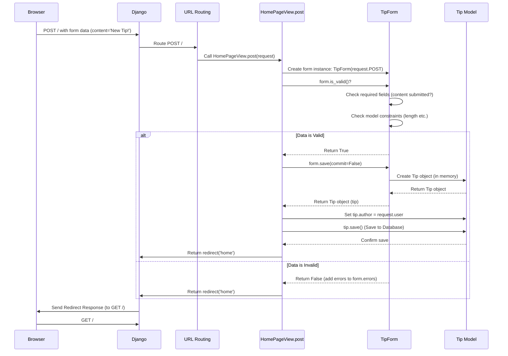

# Chapter 5: Forms (Tip Submission)

Welcome back! In [Chapter 4: Templates (HTML Rendering - Implicit)](04_templates__html_rendering___implicit__.md), we saw how Django uses template files (like `home.html`) and data from our views to generate the final HTML pages that users see in their browsers. We learned how templates display information like the list of tips and the username.

But websites aren't just for *showing* information; they also need to *collect* information from users. How does someone add their own brilliant life pro tip to our site? They need a way to type it in and submit it. This is where **Forms** come in.

**Use Case:** Imagine a user visits our site and has a great tip they want to share. They need an input box where they can type the tip's content and a button to click to submit it. Our application then needs to receive that submitted text, check if it's valid (e.g., not empty), and save it as a new `Tip` in our database, associated with the user who submitted it.

**Analogy: The Application Form**

Think about filling out a form in real life, like applying for a library card or a job.

*   **Structure:** The form has specific boxes or fields for specific information (Name, Address, Phone Number, Tip Content).
*   **Instructions/Rules:** It might tell you which fields are required, or that the phone number must be digits only.
*   **Submission:** You fill it out and hand it in.
*   **Processing:** Someone checks if you filled it out correctly (validation) and then files the information (saves the data).

HTML Forms on websites work similarly, and Django provides powerful tools to manage them, making the process of defining the structure, displaying the fields, validating the input, and processing the submitted data much easier.

## What are Forms in Django?

In web development, forms are typically created using the `<form>` tag in HTML. Inside this tag, you have input fields like `<input type="text">`, `<textarea>`, and a `<button type="submit">`.

Django takes this concept further with its `Form` system. Instead of just writing raw HTML, Django lets you define the structure and rules of your form using Python classes. This offers several advantages:

1.  **Structure Definition:** Define the fields your form needs in one place (a Python class).
2.  **Rendering:** Django can automatically generate the necessary HTML input fields based on your Python definition.
3.  **Validation:** Django can automatically check if the data submitted by the user matches the rules you defined (e.g., is a field required? Is it the right type of data?).
4.  **Data Cleaning:** Convert the submitted data into clean, usable Python data types.

## Our Form: `TipForm`

For our `Life-Pro-Tips` project, users need to submit the content of their tip. Since a tip is directly related to our `Tip` data model ([Chapter 1: Data Models (Tip & User)](01_data_models__tip___user__.md)), Django offers a convenient shortcut called `ModelForm`. A `ModelForm` automatically builds a form based on a specified model.

Let's look at our `TipForm` definition in `ex/forms.py`:

```python
# ex/forms.py

from django import forms
from .models import Tip # Import the Tip model blueprint

# This class defines the form for submitting a new Tip
class TipForm(forms.ModelForm):
    # The 'Meta' class tells Django how to build the form
    class Meta:
        # Build the form based on the 'Tip' model
        model = Tip
        # Include only the 'content' field from the Tip model in this form
        fields = ['content']
        # Optional: Add some styling attributes to the input field
        widgets = {
            'content': forms.Textarea(attrs={'class': 'form-control tip-textarea', 'style': 'height: 100px;'})
        }
```

Let's break this down:

*   **`class TipForm(forms.ModelForm):`**: We define a Python class `TipForm` that inherits from `forms.ModelForm`. This tells Django it's a form linked to a model.
*   **`class Meta:`**: This inner class holds the configuration for the `ModelForm`.
*   **`model = Tip`**: We specify that this form is based on our `Tip` model. Django will look at the fields defined in the `Tip` model (like `content`, `author`, `date`, etc.).
*   **`fields = ['content']`**: We tell Django which fields from the `Tip` model should be included as input fields in our form. Here, we only want the user to provide the `content`. We *don't* want them to manually choose the author or the date – the view will handle that later.
*   **`widgets = {...}`**: This is optional. It allows us to customize how a specific field is displayed in HTML. Here, we're telling Django to render the `content` field using a `<textarea>` HTML element (which is suitable for longer text) and add some CSS classes and styling to make it look nice.

So, this simple Python class defines everything Django needs to know about our tip submission form: it needs one field called `content`, based on the `Tip` model's `content` field, and it should be displayed as a styled textarea.

## Displaying the Form

How does this `TipForm` actually appear on the web page? We saw a glimpse of this in [Chapter 4: Templates (HTML Rendering - Implicit)](04_templates__html_rendering___implicit__.md).

First, our `HomePageView` creates an instance of the form and passes it to the template's context (but only if the user is logged in):

```python
# ex/views.py (HomePageView.get method snippet)

# ...inside the get method...
form = TipForm() if request.user.is_authenticated else None
context = {
    # ... other context data ...
    'form': form,
}
return render(request, 'home.html', context)
```

Then, inside the conceptual `home.html` template, we use the `form` variable from the context:

```html
<!-- Conceptual ex/templates/home.html (Form part) -->

 {# Only show this if 'form' exists in context #}
    <h2>Submit a New Tip:</h2>
    <form method="post" action=""> {# Submit to homepage URL #}
         {# Important security tag! #}

        {{ form.as_p }} {# Render the form fields as paragraphs #}

        <button type="submit">Submit Tip</button>
    </form>

```

*   **``**: Checks if the `form` variable was passed from the view (meaning the user is logged in and allowed to submit).
*   **`<form method="post" ...>`**: This is the standard HTML form tag. `method="post"` means the data will be sent in the body of the request (standard for submitting data). `action=""` uses a template tag to generate the URL for the 'home' route (our `HomePageView`), ensuring the form submits back to the same view that displayed it.
*   **``**: This is a crucial **security** feature in Django. It helps prevent Cross-Site Request Forgery attacks by adding a hidden input field with a unique token. Django checks this token when the form is submitted. Always include this inside your `<form>` tags for POST requests!
*   **`{{ form.as_p }}`**: This is Django's magic! It takes the `TipForm` object we created in the view and automatically renders its fields (in this case, just the `content` textarea) wrapped in `<p>` (paragraph) tags. Django knows how to create the `<label>`, `<textarea>`, and any necessary attributes based on the `TipForm` definition. Other options like `form.as_ul` (list items) or `form.as_table` exist, or you can render fields individually for more control.

So, when a logged-in user visits the homepage, they see the HTML form generated by Django, ready for them to type their tip.

## Handling Form Submission

Okay, the user types their tip and clicks "Submit Tip". What happens next?

1.  The browser sends an HTTP `POST` request back to the server, targeting the URL specified in the form's `action` attribute (which is our homepage URL, handled by `HomePageView`). The data typed into the form fields is included in this request.
2.  [URL Routing](03_url_routing_.md) directs this `POST` request to the correct view method. Since `HomePageView` is a class-based view, Django automatically calls its `post` method (instead of `get`).
3.  The `post` method in `HomePageView` handles the submitted data.

Let's look at the `post` method again:

```python
# ex/views.py (HomePageView.post method)

from django.shortcuts import redirect
from .forms import TipForm # Import the form

# ...inside HomePageView class...
def post(self, request):
    # 1. Check if user is logged in (only they can post)
    if request.user.is_authenticated:
        # 2. Create a TipForm instance, POPULATED with the submitted data
        #    request.POST contains the data sent by the browser's form
        form = TipForm(request.POST)

        # 3. Validate the submitted data
        if form.is_valid():
            # 4. Data is valid! Process it.
            #    Create a Tip object from the form, but DON'T save to DB yet.
            tip = form.save(commit=False)
            # 5. Set the author manually (it wasn't part of the form)
            tip.author = request.user
            # 6. Now, save the complete Tip object to the database
            tip.save()
            # Optional: Maybe add a success message here

    # 7. Redirect the user back to the homepage
    #    This prevents issues with refreshing after POST and shows the new tip.
    return redirect('home')
```

Step-by-step breakdown of the `post` method:

1.  **Authentication Check:** It first checks if `request.user.is_authenticated` to ensure only logged-in users can submit tips.
2.  **Instantiate Form with Data:** `form = TipForm(request.POST)` is key. Instead of an empty `TipForm()`, we create an instance *using the submitted data*. `request.POST` is a dictionary-like object containing the data sent from the browser's form (e.g., `{'content': 'Always eat your vegetables!'}`). Django uses this data to populate the form instance.
3.  **Validation:** `if form.is_valid():` is where Django's form magic shines. This method runs all the validation checks:
    *   Did the user submit data for all required fields (defined in `TipForm` / `Tip` model)? In our case, `content` is required.
    *   Is the submitted data of the correct type? (e.g., `TextField` expects text).
    *   It uses the rules derived from the `Tip` model because `TipForm` is a `ModelForm`. If `content` had length restrictions in the model, `is_valid()` would check those too.
4.  **Process Valid Data:** If `is_valid()` returns `True`, we know the submitted data is good.
5.  **`tip = form.save(commit=False)`**: Because `TipForm` is a `ModelForm`, it has a handy `.save()` method. This method normally creates and saves a `Tip` model instance directly to the database based on the valid form data. However, we use `commit=False` because our form *didn't* include the `author` field. We need to set the author manually before saving. `commit=False` creates the `Tip` object in memory but prevents it from hitting the database just yet.
6.  **`tip.author = request.user`**: We set the `author` field of our newly created `Tip` object to the currently logged-in user, available via `request.user`.
7.  **`tip.save()`**: Now that the `Tip` object has all its required information (content from the form, author from the request), we call the model's standard `save()` method to store it permanently in the database.
8.  **`return redirect('home')`**: After successfully processing the form, it's standard practice to redirect the user. We redirect them back to the homepage (`'home'` route). The browser will then make a *new* `GET` request for the homepage. When the `HomePageView.get` method runs this time, it will fetch *all* tips, including the one just submitted, and display the updated list. This pattern is called Post/Redirect/Get and avoids problems like accidental double submissions if the user refreshes the page after submitting.

## How `is_valid()` Works (Simplified Internals)

When you call `form.is_valid()`, Django performs a sequence of checks based on the form's definition:

1.  **Bound Check:** Is the form "bound" to data? (i.e., was it created with data like `TipForm(request.POST)`?). If not, it's invalid.
2.  **Field Iteration:** Django loops through each field defined in the form (`content` in our case).
3.  **Data Extraction:** For each field, it tries to extract the corresponding value from the submitted data (`request.POST`).
4.  **Validation Checks:** It runs built-in and custom validation rules for that field:
    *   **Required:** Is the field required, and was data provided? (Our `content` field is required by default because it's not `blank=True` or `null=True` in the `Tip` model).
    *   **Data Type:** Does the data look like the expected type? (`TextField` is quite flexible).
    *   **Model Validation:** Since it's a `ModelForm`, it also runs validation rules derived from the `Tip` model itself (e.g., maximum length if defined).
5.  **Error Collection:** If any check fails for a field, Django adds an error message associated with that field to a special `form.errors` dictionary.
6.  **Return Value:** If `form.errors` is empty after checking all fields, `is_valid()` returns `True`. Otherwise, it returns `False`.

If `is_valid()` returns `False`, the `HomePageView.get` method would typically be re-rendered, but this time `{{ form.as_p }}` would also display the error messages next to the problematic fields, prompting the user to correct their input. (Our current `post` method redirects immediately, but in more complex forms, you'd often re-render the template with the errors).

Here's a simplified diagram of the form submission and validation flow:



## Conclusion

We've learned how Django **Forms** provide a structured way to handle user input. They define the expected fields (`TipForm`), help render the HTML input elements in [Templates (HTML Rendering - Implicit)](04_templates__html_rendering___implicit__.md) (using `{{ form.as_p }}`), and crucially, provide a robust way to **validate** submitted data (`form.is_valid()`) in our [Views (Request Handling Logic)](02_views__request_handling_logic__.md).

We saw how `ModelForm` simplifies creating forms based directly on our [Data Models (Tip & User)](01_data_models__tip___user__.md), automatically handling much of the structure and validation based on the model definition. We also learned the typical workflow for handling form submissions in a view: instantiate the form with `request.POST`, check `is_valid()`, process the data (often saving a model instance), and finally redirect the user.

We used `request.user.is_authenticated` and `request.user` quite a bit. This implies that the system knows *who* the user is. How does login and logout work? How do we ensure only the author can delete their own tip, or only users with enough reputation can downvote? That's all about managing users, their identities, and what they are allowed to do.

Let's dive into how Django handles user accounts and controls access: [Chapter 6: User Authentication & Permissions](06_user_authentication___permissions_.md).

---

Generated by [AI Codebase Knowledge Builder](https://github.com/The-Pocket/Tutorial-Codebase-Knowledge)