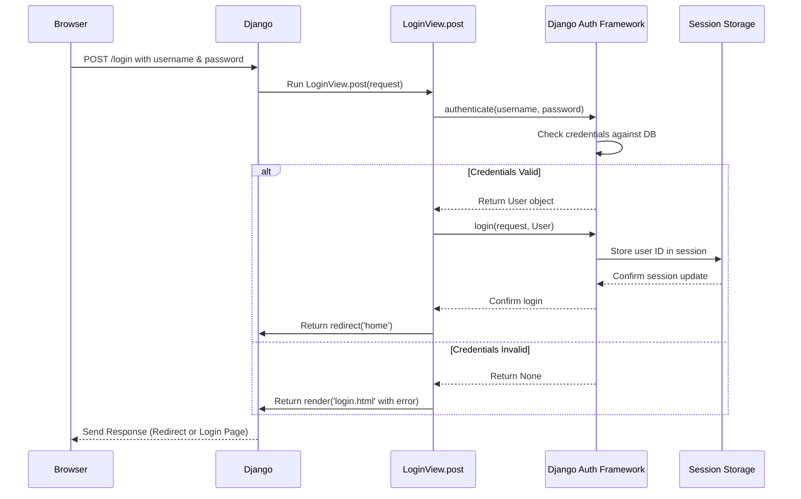
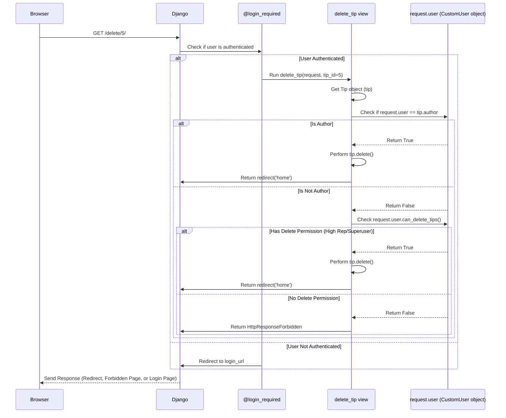

# Chapter 6: User Authentication & Permissions

Welcome back! In [Chapter 5: Forms (Tip Submission)](05_forms__tip_submission_.md), we learned how to create forms using Django, allowing users to input data like new Life Pro Tips. We saw how the `TipForm` helps us display input fields and how the `HomePageView` processes the submitted data, including setting the tip's `author` using `request.user`.

But wait, how does the application know *who* `request.user` is? How does it know if a user is logged in or just a visitor? And how do we control *what* logged-in users can do? For example, maybe only the original author or a high-status user should be allowed to delete a tip.

This is where **User Authentication and Permissions** come in. It's like the security system and membership club rules for our website.

**Use Case:** We want our Life-Pro-Tips site to:
1.  Allow users to create accounts (Register).
2.  Let registered users log in and log out.
3.  Only allow logged-in users to submit new tips.
4.  Only allow the user who wrote a tip (the author) or a user with high "reputation" to delete that tip.
5.  Perhaps restrict downvoting to users who have earned some reputation points.

**Analogy: A Members-Only Club**

Think of our website like a special club:

*   **Registration:** Filling out the membership application form.
*   **Login:** Showing your membership card at the door to get in.
*   **Logout:** Leaving the club.
*   **Authentication:** The process of verifying your identity (checking your membership card).
*   **Permissions:** The rules about what members can do based on their membership level (e.g., basic members can use the main hall, premium members get access to the VIP lounge).

Django has a powerful built-in system to handle most of this for us!

## What is Authentication? (Are You Who You Say You Are?)

Authentication is all about verifying identity. It answers the question: "Is this user really the person they claim to be?". This typically involves three main actions:

1.  **Registration:** A new user provides credentials (like a unique username and a password) to create an account.
2.  **Login:** An existing user provides their credentials, which the system checks against its records. If they match, the system knows who the user is for their current session.
3.  **Logout:** The user explicitly tells the system to "forget" their identity for the current session.

Django provides tools and views to handle these processes securely and efficiently.

## How Django Handles Authentication

Django comes with a built-in authentication framework that makes managing users, logging them in, and logging them out quite straightforward.

### The Magical `request.user`

Remember `request.user` from previous chapters? This is a central piece of Django's auth system. When a request comes into a view:

*   If the user is **not logged in**, `request.user` is an instance of `AnonymousUser`. You can check this with `request.user.is_authenticated` (which will be `False`).
*   If the user **is logged in**, Django uses session information (usually stored in cookies) to identify the user. `request.user` becomes an instance of our user model ([`CustomUser`](01_data_models__tip___user__.md)) representing the logged-in user. In this case, `request.user.is_authenticated` will be `True`.

This `request.user` object is automatically available in all your views thanks to Django's `AuthenticationMiddleware` (which we'll touch on in [Chapter 9: Middleware (Username Handling)](09_middleware__username_handling__.md)).

### Key Authentication Functions

Django provides helper functions to perform the core authentication tasks:

*   `authenticate(request, username='...', password='...')`: Checks if the given username and password are valid. If they are, it returns the corresponding user object (`CustomUser` instance). If not, it returns `None`.
*   `login(request, user)`: Takes a `request` object and a user object (returned by `authenticate`). It attaches the user's ID to the session, effectively logging the user in. From this point on (in subsequent requests from the same browser), `request.user` will be set to this user.
*   `logout(request)`: Removes the user's ID from the session, effectively logging them out. `request.user` will become an `AnonymousUser` again in subsequent requests.

### Authentication Views in Our Project (`ex/views.py`)

Our project has specific views to handle login, registration, and logout, using these functions.

**Login (`LoginView`)**

The `LoginView` displays the login form (`get` method) and handles the submission (`post` method).

```python
# ex/views.py (Simplified LoginView.post)

from django.shortcuts import render, redirect
from django.contrib.auth import authenticate, login # Import helpers
from django.contrib import messages # For showing errors

class LoginView(View):
    # ... get method displays the login form ...

    def post(self, request):
        if request.user.is_authenticated: # Already logged in? Go home.
            return redirect('home')

        username = request.POST['username'] # Get username from submitted form
        password = request.POST['password'] # Get password from submitted form

        # 1. Try to verify credentials
        user = authenticate(request, username=username, password=password)

        # 2. Check if authentication succeeded
        if user is not None:
            # 3. Log the user in
            login(request, user)
            return redirect('home') # Send them to the homepage
        else:
            # Auth failed, show an error message
            messages.error(request, 'Invalid username or password')
            # Show the login page again
            return render(request, 'login.html', {'username': request.defaultName})
```

1.  We get the `username` and `password` the user typed into the form (`request.POST`).
2.  `user = authenticate(...)`: We ask Django to check if these credentials match a user in the database.
3.  `if user is not None:`: If `authenticate` returns a user object, the credentials were correct.
4.  `login(request, user)`: We tell Django to log this user in, associating their ID with the current session.
5.  `redirect('home')`: We send the now-logged-in user to the homepage.
6.  If `user` is `None`, we show an error and redisplay the login form.

**Registration (`RegistrationView`)**

The `RegistrationView` handles creating a new user account.

```python
# ex/views.py (Simplified RegistrationView.post)

from django.shortcuts import render, redirect
from django.contrib.auth import login, get_user_model # Import login helper
from django.contrib import messages

class RegistrationView(View):
    # ... get method displays registration form ...

    def post(self, request):
        # ... (basic checks: already logged in?, passwords match?, username exists?) ...

        username = request.POST['username']
        password = request.POST['pass']

        User = get_user_model() # Get our CustomUser model

        # Example checks (simplified)
        if password != request.POST['secur_pass']:
             messages.error(request, 'Passwords do not match')
        elif User.objects.filter(username=username).exists():
             messages.error(request, 'Username already taken')
        else:
            # 1. Create the new user (securely handles password hashing)
            user = User.objects.create_user(username=username, password=password)
            # 2. Log the new user in immediately
            login(request, user)
            return redirect('home') # Send to homepage

        # If checks fail, show registration page again with errors
        return render(request, 'registration.html', {'username': "Guest"})
```

1.  After performing basic checks (like ensuring passwords match and the username isn't already taken), we use `User.objects.create_user(...)`. This is the standard way to create a new user; it automatically handles the secure hashing of the password.
2.  `login(request, user)`: We immediately log the newly registered user in.
3.  `redirect('home')`: We send them to the homepage.

**Logout (`LogoutView`)**

Logging out is simpler.

```python
# ex/views.py (Simplified LogoutView.get)

from django.shortcuts import redirect
from django.contrib.auth import logout # Import helper
from django.contrib.auth.mixins import LoginRequiredMixin # Protection!
from django.views import View

# Ensures only logged-in users can access the logout URL
class LogoutView(LoginRequiredMixin, View):
    def get(self, request):
        # 1. Log the user out
        logout(request)
        # 2. Redirect to homepage
        return redirect('home')
```

1.  `logout(request)`: This single function call does the job of clearing the user's session data.
2.  `redirect('home')`: We send the now-logged-out user back to the homepage.

### Protecting Views (Ensuring Login)

We often have views that should *only* be accessible to logged-in users (like posting a tip, voting, or viewing a profile page). Django provides easy ways to enforce this:

*   **For Function-Based Views:** Use the `@login_required` decorator.

    ```python
    # ex/views.py (upvote_tip example)
    from django.contrib.auth.decorators import login_required

    @login_required(login_url='/login') # Decorator goes above the function
    def upvote_tip(request, tip_id):
        # This code will only run if request.user.is_authenticated is True.
        # If not logged in, Django automatically redirects the user to
        # the URL specified in login_url (or the default login URL).
        tip = get_object_or_404(Tip, id=tip_id)
        # ... (upvote logic using request.user) ...
        return redirect('home')
    ```

*   **For Class-Based Views:** Inherit from `LoginRequiredMixin`.

    ```python
    # ex/views.py (LogoutView example)
    from django.contrib.auth.mixins import LoginRequiredMixin

    # LoginRequiredMixin must usually come BEFORE View in inheritance
    class LogoutView(LoginRequiredMixin, View):
        login_url = '/login' # Optional: Where to redirect if not logged in
        # redirect_field_name = 'redirect_to' # Optional

        def get(self, request):
            # This get method will only be called if the user is logged in.
            logout(request)
            return redirect('home')
    ```

These decorators and mixins check `request.user.is_authenticated`. If it's `False`, they automatically redirect the user to the login page (usually `/login/` or the URL specified in `login_url`), often adding a parameter so the user is sent back to the original page they were trying to access after logging in.

## What are Permissions? (What Are You Allowed To Do?)

Okay, so authentication verifies *who* the user is. **Permissions** determine *what* an authenticated user is allowed to do.

Just because you're logged in (you showed your membership card) doesn't mean you can do everything. Maybe only members who've been around longer or contributed more (higher reputation) get special privileges.

**Analogy:** At the club, basic members can enter, but only premium members can access the rooftop pool. Accessing the pool requires not just authentication (being a member) but also permission (having a premium membership).

In our app, examples include:
*   Can this user downvote a tip?
*   Can this user delete this specific tip?

Django has a built-in permission system (often tied to user groups or specific flags on the user model), but for `Life-Pro-Tips`, we've implemented a simpler, custom system based mainly on **user reputation**.

## How Our Project Handles Permissions

We defined our own `CustomUser` model in [Chapter 1: Data Models (Tip & User)](01_data_models__tip___user__.md). We added a `reputation` field and some custom methods to check permissions based on that reputation.

### Custom Permission Methods on `CustomUser`

Let's look back at the `CustomUser` model:

```python
# ex/models.py (CustomUser permission methods)

class CustomUser(AbstractUser):
    reputation = models.IntegerField(default=0)

    # Can this user downvote any tip?
    def can_downvote(self):
        # Allowed if reputation is 15 or more, OR if they are a superuser (admin)
        return self.reputation >= 15 or self.is_superuser

    # Can this user delete any tip (even if not their own)?
    def can_delete_tips(self):
        # Allowed if reputation is 30 or more, OR if they are a superuser
        return self.reputation >= 30 or self.is_superuser

    # (update_reputation method calculates reputation based on votes - covered in Chapter 7)
    # def update_reputation(self): ...
```

*   `can_downvote()`: Returns `True` if the user's `reputation` is 15 or higher, or if they are a superuser (an administrator account). Otherwise, returns `False`.
*   `can_delete_tips()`: Returns `True` if the user's `reputation` is 30 or higher, or if they are a superuser. This allows high-rep users to moderate content.

These methods provide a clear, reusable way to check if a user has specific privileges based on our custom logic (reputation).

### Using Permission Methods in Views

Now, let's see how these methods are used in our views to enforce the rules. Look at the `delete_tip` view:

```python
# ex/views.py (delete_tip view)

from django.shortcuts import get_object_or_404, redirect
from django.contrib.auth.decorators import login_required
from django.http import HttpResponseForbidden # Used to deny access
from .models import Tip

@login_required(login_url='/login') # Step 1: Must be logged in
def delete_tip(request, tip_id):
    tip = get_object_or_404(Tip, id=tip_id)

    # Step 2: Check permissions
    # Is the current user the author OR do they have general delete permissions?
    if request.user == tip.author or request.user.can_delete_tips():
        # Permission granted! Delete the tip.
        tip.delete()
        return redirect('home') # Go back home
    else:
        # Permission denied!
        # Return a "Forbidden" response.
        return HttpResponseForbidden("You don't have permission to delete this tip.")
```

1.  **`@login_required`**: First, we ensure the user is authenticated. Anonymous users are redirected to login.
2.  **Permission Check:**
    *   We get the `tip` object the user is trying to delete.
    *   The core logic is `if request.user == tip.author or request.user.can_delete_tips():`.
    *   `request.user == tip.author`: Checks if the logged-in user is the same person who wrote the tip. Authors should always be able to delete their own tips.
    *   `request.user.can_delete_tips()`: If the user is *not* the author, we call the custom method on our `CustomUser` object (`request.user`) to see if they have high enough reputation (or are a superuser) to delete *any* tip.
3.  **Action or Denial:**
    *   If the `if` condition is `True` (they are the author OR have general delete permission), the `tip.delete()` code runs.
    *   If the `if` condition is `False`, we return an `HttpResponseForbidden`, which typically shows an error page indicating the user doesn't have permission for this action.

Similarly, the `downvote_tip` view uses `request.user.can_downvote()` to check if the user meets the reputation requirement (currently 15) before allowing a downvote.

```python
# ex/views.py (downvote_tip snippet)

# ... inside downvote_tip view ...
    if request.user == tip.author or request.user.can_downvote(): # Check permission
        # ... (logic to add/remove downvote) ...
        tip.author.update_reputation()
    else:
        return HttpResponseForbidden("You don't have permission to downvote this tip.")
    return redirect('home')
# ...
```

## Putting it Together: The Flow

Let's visualize the process for login and for a permission check like deleting a tip.

**Login Flow:**



**Permission Check Flow (Deleting a Tip):**



## Conclusion

In this chapter, we explored the vital concepts of **User Authentication** (verifying who a user is via registration, login, and logout) and **Permissions** (determining what an authenticated user is allowed to do).

We saw how Django's built-in authentication framework (`authenticate`, `login`, `logout`, `request.user`, `@login_required`, `LoginRequiredMixin`) provides a secure and convenient foundation. We also learned how we extended this by adding custom permission logic to our `CustomUser` model, using methods like `can_downvote()` and `can_delete_tips()` based on the user's `reputation` score. These custom checks allow us to implement the specific access rules for our Life-Pro-Tips application, like controlling who can delete or downvote tips.

But how does a user's `reputation` score actually get calculated? How do upvotes and downvotes affect it? That's the focus of our next chapter, where we'll dive into the voting mechanism and the reputation system itself.

Let's move on to understand how votes translate into reputation points: [Chapter 7: Tip Voting & Reputation System](07_tip_voting___reputation_system_.md).

---

Generated by [AI Codebase Knowledge Builder](https://github.com/The-Pocket/Tutorial-Codebase-Knowledge)