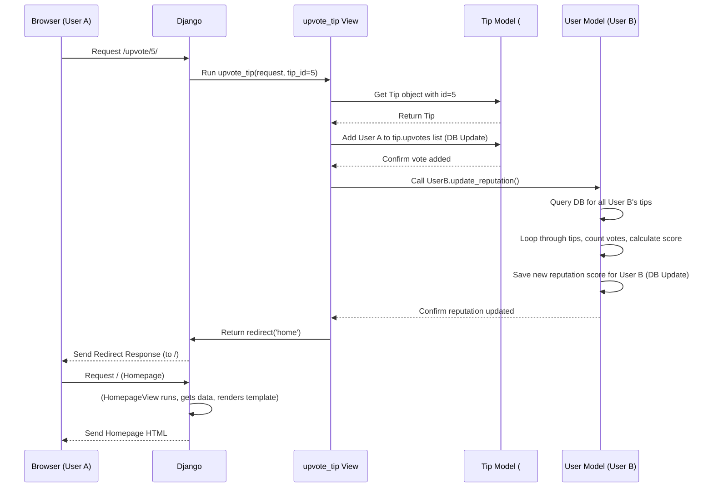

# Chapter 7: Tip Voting & Reputation System

Welcome back! In [Chapter 6: User Authentication & Permissions](06_user_authentication___permissions_.md), we learned how our site manages user accounts – allowing users to register, log in, and log out – and how we control what they can do based on who they are and their standing (like reputation). We saw methods like `can_downvote()` that rely on a user's `reputation` score.

But how does a user *get* reputation? How does the site know which tips are genuinely helpful according to the community? This is where our **Tip Voting & Reputation System** comes in.

**Use Case:** Imagine you're browsing the Life Pro Tips. You see a really clever tip that saves you time! You want to signal that this tip is good, so others see it. You click the "upvote" arrow. Conversely, you see a tip that's inaccurate or unhelpful, so you click "downvote". The author of the great tip should gain some recognition (reputation), while the author of the unhelpful tip might lose some.

**Analogy: Community Feedback and Karma**

Think of sites like Reddit or Stack Overflow. Users can vote on posts and comments. Good content gets upvoted and becomes more visible, and the authors often gain "karma" or points. Bad content gets downvoted. Our system works similarly:

*   **Voting:** Lets the community provide feedback on each tip.
*   **Reputation:** A score for each user, reflecting how helpful the community finds their contributions (their tips).

This system helps surface the best tips and rewards users who consistently share valuable advice.

## Key Components

Our system has two main parts that work together:

1.  **Tip Voting Mechanism:** Allows authenticated users to upvote or downvote individual tips.
2.  **Reputation Calculation:** Automatically calculates a user's reputation score based on the votes received on all the tips they have authored.

Let's look at how each part works.

### 1. Tip Voting Mechanism

When you look at a tip on the site, you'll typically see upvote and downvote buttons (often arrows). Clicking these buttons triggers specific actions.

**How it Connects:**

*   **Models ([Chapter 1: Data Models (Tip & User)](01_data_models__tip___user__.md)):** Remember our `Tip` model? It has two crucial fields:
    *   `upvotes = models.ManyToManyField(CustomUser, ...)`: A list of all users who have upvoted this tip.
    *   `downvotes = models.ManyToManyField(CustomUser, ...)`: A list of all users who have downvoted this tip.
    A `ManyToManyField` is perfect here because one tip can be upvoted by *many* users, and one user can upvote *many* tips.

*   **Views ([Chapter 2: Views (Request Handling Logic)](02_views__request_handling_logic__.md)):** We have specific view functions that handle clicks on the vote buttons:
    *   `upvote_tip(request, tip_id)`: Handles clicks on the upvote button for the tip with the given `tip_id`.
    *   `downvote_tip(request, tip_id)`: Handles clicks on the downvote button.

*   **URLs ([Chapter 3: URL Routing](03_url_routing_.md)):** We have URL patterns that link the vote buttons to these views:
    *   `/upvote/<tip_id>/` maps to the `upvote_tip` view.
    *   `/downvote/<tip_id>/` maps to the `downvote_tip` view.

**The Voting Logic (Simplified `upvote_tip` View):**

When a logged-in user clicks the upvote button for a tip:

```python
# ex/views.py (Simplified upvote_tip view)

from django.shortcuts import get_object_or_404, redirect
from django.contrib.auth.decorators import login_required
from .models import Tip

@login_required(login_url='/login') # User must be logged in
def upvote_tip(request, tip_id):
    # 1. Find the specific tip being voted on
    tip = get_object_or_404(Tip, id=tip_id)
    user = request.user # The user who clicked the button

    # 2. Handle the vote logic
    # If user had downvoted, remove the downvote
    if user in tip.downvotes.all():
        tip.downvotes.remove(user)

    # If user had already upvoted, remove the upvote (toggle off)
    if user in tip.upvotes.all():
        tip.upvotes.remove(user)
    # Otherwise, add the upvote (toggle on)
    else:
        tip.upvotes.add(user)

    # 3. IMPORTANT: Update the author's reputation score!
    tip.author.update_reputation()

    # 4. Send the user back to the homepage
    return redirect('home')
```

1.  **`@login_required`**: Ensures only logged-in users can vote.
2.  **Find Tip:** Gets the `Tip` object based on the `tip_id` from the URL.
3.  **Vote Logic:**
    *   Checks if the user previously downvoted this tip. If so, it removes them from the `tip.downvotes` list. You can't simultaneously upvote and downvote.
    *   Checks if the user has already upvoted this tip. If so, clicking upvote again *removes* the upvote (like toggling a like button).
    *   If they haven't upvoted it yet, it *adds* the user to the `tip.upvotes` list.
    *   The `downvote_tip` view works similarly but handles the `tip.downvotes` list and checks the `can_downvote()` permission we saw in Chapter 6.
4.  **`tip.author.update_reputation()`**: This is crucial! After changing the votes on a tip, we need to tell the system to recalculate the reputation score for the user who *wrote* the tip (`tip.author`).
5.  **Redirect:** Sends the user back to the homepage to see the updated vote counts.

### 2. Reputation Calculation

The reputation score isn't directly voted on. It's calculated automatically based on the votes received by the tips written *by* a user.

**How it Connects:**

*   **Models ([Chapter 1: Data Models (Tip & User)](01_data_models__tip___user__.md)):** Our `CustomUser` model has:
    *   `reputation = models.IntegerField(default=0)`: Stores the calculated score.
    *   `update_reputation()`: A custom method we added to perform the calculation.

**The `update_reputation()` Method:**

This method lives inside the `CustomUser` model and defines how we calculate the score.

```python
# ex/models.py (CustomUser's update_reputation method)

class CustomUser(AbstractUser):
    reputation = models.IntegerField(default=0)
    # ... other methods like can_downvote ...

    def update_reputation(self):
        # Start score at 0 for this calculation
        new_reputation = 0
        # Loop through ALL tips written by this user ('self')
        # 'self.tips' works because of related_name='tips' on Tip.author
        for tip in self.tips.all():
            # Add points for each upvote on this tip
            new_reputation += tip.upvotes.count() * 5 # +5 points per upvote
            # Subtract points for each downvote on this tip
            new_reputation -= tip.downvotes.count() * 2 # -2 points per downvote

        # Ensure reputation doesn't go below zero
        self.reputation = max(new_reputation, 0)
        # Save the updated score back to the database for this user
        self.save(update_fields=['reputation']) # Efficiently save only reputation
```

*   It initializes a `new_reputation` counter to zero.
*   It iterates through every `Tip` associated with the current user (`self.tips.all()`). Remember, the `related_name='tips'` on the `Tip.author` field makes this easy.
*   For each tip, it counts the number of users in the `upvotes` list (`tip.upvotes.count()`) and adds points (5 per upvote).
*   It counts the number of users in the `downvotes` list (`tip.downvotes.count()`) and subtracts points (2 per downvote).
*   It makes sure the final score isn't negative (`max(new_reputation, 0)`).
*   Finally, `self.save(...)` updates the user's record in the database with the newly calculated `reputation` score.

**When is `update_reputation()` Called?**

The reputation needs to be recalculated whenever the votes on a user's tip change. This happens in a few key places:

1.  **After a Vote:** As we saw in the `upvote_tip` and `downvote_tip` views, `tip.author.update_reputation()` is called right after a vote is added or removed.
2.  **When a Tip is Saved/Deleted:** What if a tip is deleted? The votes on it should no longer count towards the author's reputation. Django allows us to hook into the `save()` and `delete()` processes of a model.

```python
# ex/models.py (Tip model's save and delete methods)

class Tip(models.Model):
    # ... fields like content, author, upvotes, downvotes ...

    # This method is called whenever a Tip object is saved
    def save(self, *args, **kwargs):
        # Run the standard saving process first
        super().save(*args, **kwargs)
        # THEN, update the reputation of the tip's author
        if hasattr(self, 'author') and self.author:
             self.author.update_reputation()

    # This method is called right before a Tip object is deleted
    def delete(self, *args, **kwargs):
        # Store the author BEFORE deleting the tip
        author_to_update = self.author
        # Run the standard deletion process
        super().delete(*args, **kwargs)
        # THEN, update the stored author's reputation
        if author_to_update:
            author_to_update.update_reputation()
```

By overriding the `save` and `delete` methods on the `Tip` model, we ensure that the author's reputation is always kept up-to-date whenever a tip they wrote is created, modified (though votes are the main modification here), or deleted.

## Internal Flow: Upvoting a Tip

Let's trace the steps involved when User A upvotes a tip written by User B:

1.  **User A Clicks Upvote:** User A clicks the upvote button for Tip #5 (written by User B). The browser sends a request (likely a POST or GET depending on implementation) to `/upvote/5/`.
2.  **URL Routing ([Chapter 3: URL Routing](03_url_routing_.md)):** Django maps `/upvote/5/` to the `upvote_tip` view function, passing `tip_id=5`.
3.  **View Logic (`upvote_tip` in [Chapter 2: Views (Request Handling Logic)](02_views__request_handling_logic__.md)):**
    *   The `@login_required` decorator checks if User A is logged in. Let's assume yes.
    *   The view fetches Tip #5 from the database.
    *   The view modifies Tip #5's `upvotes` list (a `ManyToManyField` in [Chapter 1: Data Models (Tip & User)](01_data_models__tip___user__.md)) by adding User A to it. (Database interactions happen here).
    *   The view calls `tip.author.update_reputation()`. Since User B is the author, this calls `UserB.update_reputation()`.
4.  **Reputation Calculation (`update_reputation` in [Chapter 1: Data Models (Tip & User)](01_data_models__tip___user__.md)):**
    *   The `update_reputation` method runs for User B.
    *   It queries the database to find all tips written by User B.
    *   For each tip (including Tip #5, which now has User A's upvote), it counts the upvotes and downvotes.
    *   It calculates the total reputation score based on the formula (+5 per upvote, -2 per downvote).
    *   It saves the new reputation score to User B's record in the `CustomUser` table in the database.
5.  **View Response:** The `upvote_tip` view returns a `redirect('home')` response.
6.  **Browser Redirects:** Django sends the redirect instruction to User A's browser. The browser makes a *new* request to the homepage (`/`).
7.  **Homepage Renders:** The `HomePageView` runs, fetches all tips (including Tip #5 with its updated vote count) and user data (including User B's potentially updated reputation, though it might not be directly displayed), and renders the `home.html` template ([Chapter 4: Templates (HTML Rendering - Implicit)](04_templates__html_rendering___implicit__.md)). User A sees the homepage with the upvote visually registered.

Here's a diagram of that flow:



## Conclusion

We've now seen how the **Tip Voting & Reputation System** creates a dynamic feedback loop within our application. Users provide input by **voting** on tips, which directly modifies the `upvotes` and `downvotes` relationships stored in our `Tip` model ([Chapter 1: Data Models (Tip & User)](01_data_models__tip___user__.md)).

This voting activity, along with tip creation and deletion, triggers the recalculation of the author's **reputation** via the `update_reputation()` method in the `CustomUser` model. This score then influences permissions, as seen in [Chapter 6: User Authentication & Permissions](06_user_authentication___permissions_.md), creating a system where helpful contributions are recognized and potentially grant users more capabilities.

We've covered the core application logic: models, views, URLs, templates, forms, authentication, and the voting/reputation system. But how does Django know which database to use? How does it find our apps and templates? These are defined in the project's overall settings.

Let's move on to explore the files that configure our entire Django project: [Chapter 8: Project Configuration](08_project_configuration_.md).

---

Generated by [AI Codebase Knowledge Builder](https://github.com/The-Pocket/Tutorial-Codebase-Knowledge)