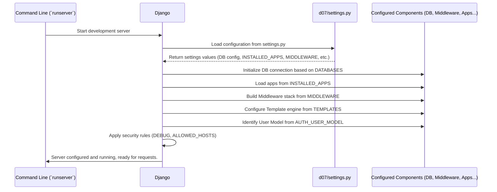

# Chapter 8: Project Configuration

Welcome back! In [Chapter 7: Tip Voting & Reputation System](07_tip_voting___reputation_system_.md), we saw how user votes influence tip visibility and author reputation, creating a dynamic feedback system. We've now covered most of the *logic* of our application – how data is structured ([Data Models (Tip & User)](01_data_models__tip___user__.md)), how requests are processed ([Views (Request Handling Logic)](02_views__request_handling_logic__.md)), how users navigate ([URL Routing](03_url_routing_.md)), what users see ([Templates (HTML Rendering - Implicit)](04_templates__html_rendering___implicit__.md)), how they submit data ([Forms (Tip Submission)](05_forms__tip_submission_.md)), and how we manage identity and access ([User Authentication & Permissions](06_user_authentication___permissions_.md)).

But how does the whole project *know* how to fit these pieces together? Where do we tell Django which database to use? Which features (apps) are included? What security settings are in place?

This is where **Project Configuration** comes in, primarily managed through a special file called `settings.py`.

**Use Case:** Imagine you're looking at the `Life-Pro-Tips` project code for the first time. How would you quickly understand its fundamental setup? You'd want to know:
*   What database is it using (SQLite, PostgreSQL, etc.)?
*   What are the main functional modules (apps) included?
*   What is the main file for URL patterns?
*   Is it running in a development mode with extra debugging info?
*   What security measures are active?

The project configuration file (`settings.py`) answers all these questions and more.

**Analogy: The Application's Constitution or Control Panel**

Think of the `settings.py` file as the **constitution** for your Django project. It lays down the fundamental laws and structures that govern the entire application. Or, picture it as the central **control panel** in a large building. It has switches and dials that configure essential services like power (database connection), security systems (security keys, allowed hosts), which departments are active (installed apps), and how visitors are routed (URL configuration).

It's the first place you should look to get a high-level overview of how a Django project is set up and what core components it uses.

## Exploring `d07/settings.py`

In our `Life-Pro-Tips` project, the main configuration file is located at `d07/settings.py` (where `d07` is the name of our project directory). Let's look at some of the most important settings inside this file.

*(Note: The actual file contains many comments explaining each setting. We'll show simplified snippets here.)*

### Security Settings

```python
# d07/settings.py (Security Snippets)

# SECURITY WARNING: keep the secret key used in production secret!
# A unique, unpredictable value used for cryptographic signing.
SECRET_KEY = 'django-insecure-...(a long random string)...'

# SECURITY WARNING: don't run with debug turned on in production!
# If True, Django shows detailed error pages (helpful for development).
# MUST be False in a live environment.
DEBUG = True

# A list of strings representing the host/domain names that this Django site can serve.
# Important security measure for production.
ALLOWED_HOSTS = [] # Empty list means only '127.0.0.1', 'localhost' work when DEBUG=True
```

*   **`SECRET_KEY`**: A crucial random string used for security purposes like session management and password resets. Keep this secret in a real project!
*   **`DEBUG`**: When `True`, Django provides detailed error messages if something goes wrong, which is great for development. When `False` (for a live website), it shows a generic error page. **Never run a live website with `DEBUG = True`!**
*   **`ALLOWED_HOSTS`**: A security measure preventing attackers from tricking your site. In production, you list the actual domain names (e.g., `['www.our-lpt-site.com']`) that your site should respond to.

### Application Definition

```python
# d07/settings.py (INSTALLED_APPS Snippet)

# Lists all Django applications ('apps') that are activated in this project.
INSTALLED_APPS = [
    # Django's built-in apps:
    'django.contrib.admin',      # The admin site
    'django.contrib.auth',       # Authentication framework (Ch 6)
    'django.contrib.contenttypes', # Framework for content types
    'django.contrib.sessions',   # Session framework
    'django.contrib.messages',   # Messaging framework
    'django.contrib.staticfiles',# Framework for managing static files (CSS, JS)

    # Our custom app:
    'ex',                        # Our Life-Pro-Tips app! (Models, Views, etc.)

    # Third-party apps:
    'bootstrap5',                # For styling
    'debug_toolbar',             # Development tool for debugging info
]
```

*   **`INSTALLED_APPS`**: This list tells Django which functional units, or "apps," are part of this project. Django uses this list to find models, templates, URL configurations, management commands, etc., within each app. We see Django's built-in apps, our own `ex` app (containing our `Tip` and `CustomUser` models from [Chapter 1: Data Models (Tip & User)](01_data_models__tip___user__.md), our views, etc.), and any third-party apps we've added.

### Middleware

```python
# d07/settings.py (MIDDLEWARE Snippet)

# A list of 'middleware' components. Think of them as layers that
# process requests and responses globally. Order matters!
MIDDLEWARE = [
    'django.middleware.security.SecurityMiddleware',
    'django.contrib.sessions.middleware.SessionMiddleware', # Handles sessions
    'django.middleware.common.CommonMiddleware',
    'django.middleware.csrf.CsrfViewMiddleware',          # Protects against CSRF attacks (Ch 5)
    'django.contrib.auth.middleware.AuthenticationMiddleware', # Adds request.user (Ch 6)
    'django.contrib.messages.middleware.MessageMiddleware',
    'django.middleware.clickjacking.XFrameOptionsMiddleware',
    'debug_toolbar.middleware.DebugToolbarMiddleware',    # Adds the debug toolbar
    'ex.middleware.UsernameMiddleware',                   # Our custom middleware (Ch 9)
]
```

*   **`MIDDLEWARE`**: Middleware are like layers of an onion that wrap around your views. Each incoming request passes *through* each middleware layer on the way *in* to the view, and the outgoing response passes *back through* them in reverse order. They perform project-wide functions like handling sessions, managing user authentication (`request.user`), adding security headers, and more. We'll explore our custom `UsernameMiddleware` in [Chapter 9: Middleware (Username Handling)](09_middleware__username_handling__.md).

### URL Configuration

```python
# d07/settings.py (ROOT_URLCONF Snippet)

# The Python path to the root URL configuration module for this project.
ROOT_URLCONF = 'd07.urls'
```

*   **`ROOT_URLCONF`**: This tells Django where to find the main `urls.py` file that starts the [URL Routing](03_url_routing_.md) process we discussed in Chapter 3.

### Templates

```python
# d07/settings.py (TEMPLATES Snippet)

TEMPLATES = [
    {
        'BACKEND': 'django.template.backends.django.DjangoTemplates',
        'DIRS': [], # You could list project-wide template folders here
        'APP_DIRS': True, # <--- Allows finding templates inside app 'templates/' dirs
        'OPTIONS': {
            'context_processors': [ # Add variables to template context automatically
                # ... standard context processors ...
                'django.contrib.auth.context_processors.auth', # Adds 'user' to context
            ],
        },
    },
]
```

*   **`TEMPLATES`**: Configures how Django finds and renders [Templates (HTML Rendering - Implicit)](04_templates__html_rendering___implicit__.md). The key setting here for us is `'APP_DIRS': True`, which tells Django to automatically look for a `templates` subdirectory inside each app listed in `INSTALLED_APPS`. This is how `render(request, 'home.html', ...)` in our view knows to find `ex/templates/home.html`.

### Database

```python
# d07/settings.py (DATABASES Snippet)

# Database configuration. Default uses a simple SQLite file.
DATABASES = {
    'default': {
        'ENGINE': 'django.db.backends.sqlite3', # Database type
        'NAME': BASE_DIR / 'db.sqlite3',       # Path to the database file
    }
}
```

*   **`DATABASES`**: Defines the connection details for the database(s) the project uses. By default, Django development projects often use SQLite, which stores the entire database in a single file (`db.sqlite3` in our project root). For larger applications, you would configure connections to databases like PostgreSQL or MySQL here. This setting tells the ORM (from [Chapter 1: Data Models (Tip & User)](01_data_models__tip___user__.md)) where to store and retrieve data.

### Authentication

```python
# d07/settings.py (AUTH_USER_MODEL Snippet)

# Tells Django to use our custom user model instead of the default one.
AUTH_USER_MODEL = 'ex.CustomUser'
```

*   **`AUTH_USER_MODEL`**: As mentioned in [Chapter 1: Data Models (Tip & User)](01_data_models__tip___user__.md) and [Chapter 6: User Authentication & Permissions](06_user_authentication___permissions_.md), this crucial setting tells Django's authentication system to use our `ex.CustomUser` model (which includes the `reputation` field) instead of the default built-in `User` model.

### Static Files

```python
# d07/settings.py (STATIC_URL Snippet)

# URL prefix for static files (CSS, JavaScript, Images) during development.
STATIC_URL = 'static/'
```

*   **`STATIC_URL`**: Defines the base URL path from which static files like CSS stylesheets and JavaScript files will be served.

## How Django Uses `settings.py`

When you run a Django command (like starting the development server with `python manage.py runserver`), the first thing Django does is load this `settings.py` file. It reads all these configurations and uses them to set up its internal machinery:

1.  **Initialization:** Django starts up.
2.  **Load Settings:** It finds and reads the `settings.py` file specified by your project setup.
3.  **Configure Components:** Based on the settings:
    *   It establishes the database connection (`DATABASES`).
    *   It loads the models from all `INSTALLED_APPS`.
    *   It sets up the template loading system (`TEMPLATES`).
    *   It compiles the middleware stack (`MIDDLEWARE`).
    *   It identifies the root URL configuration (`ROOT_URLCONF`).
    *   It recognizes the custom user model (`AUTH_USER_MODEL`).
    *   It applies security settings (`SECRET_KEY`, `DEBUG`, `ALLOWED_HOSTS`).
4.  **Ready State:** The Django project is now fully configured and ready to receive and process incoming web requests according to these settings.



Any time Django needs to know which database to talk to, which apps exist, how to find a template, or which user model to use, it refers back to the configuration loaded from `settings.py`.

## Conclusion

We've learned that the **Project Configuration**, primarily handled by the `d07/settings.py` file, acts as the central control panel or constitution for our Django application. It defines crucial settings like the `SECRET_KEY`, `DEBUG` mode, `INSTALLED_APPS`, `MIDDLEWARE` stack, `DATABASES` connection, `TEMPLATES` setup, and the `AUTH_USER_MODEL`.

Understanding `settings.py` is key to getting a high-level overview of any Django project's structure, dependencies, and core operational parameters. Django reads this file on startup to configure itself before handling any requests.

One of the important lists in `settings.py` was `MIDDLEWARE`. These components process requests and responses globally. We even have a custom one listed: `ex.middleware.UsernameMiddleware`. What does that do?

Let's explore the concept of middleware and our custom implementation in the next chapter: [Chapter 9: Middleware (Username Handling)](09_middleware__username_handling__.md).

---

Generated by [AI Codebase Knowledge Builder](https://github.com/The-Pocket/Tutorial-Codebase-Knowledge)