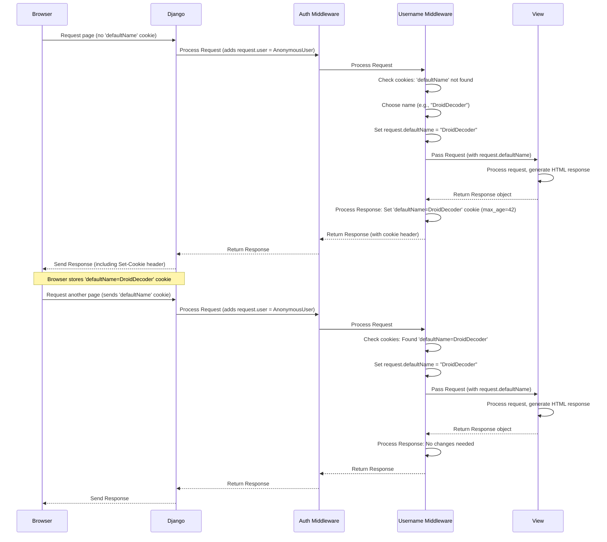

# Chapter 9: Middleware (Username Handling)

Welcome to the final chapter of our main tutorial! In [Chapter 8: Project Configuration](08_project_configuration_.md), we explored the `settings.py` file, which acts as the control panel for our Django project. We saw settings like `INSTALLED_APPS`, `DATABASES`, and importantly, a list called `MIDDLEWARE`. We even noticed our own custom `ex.middleware.UsernameMiddleware` in that list!

But what exactly *is* middleware? And what does our custom `UsernameMiddleware` do?

**Use Case:** Think about users who visit our Life-Pro-Tips site but *haven't* registered or logged in. They are "anonymous" users. Instead of just calling them "Guest", wouldn't it be fun to give them a temporary, cool-sounding name, like "GalacticVoyager" or "DroidDecoder"? We want this name to stick around for a while as they browse different pages, but we need a way to assign a new one if they don't have one yet. How can we automatically check for and assign this name for *every single request* from an anonymous user?

This is a perfect job for **Middleware**.

## What is Middleware?

Middleware components are like special checkpoints or filters that every web request has to pass through on its way to the view, and every response has to pass through on its way back to the browser.

**Analogy: The Security Checkpoint & Customs**

Imagine an airport:
*   **Incoming Request:** A passenger arriving for their flight.
*   **Middleware (Incoming):** Security checkpoints. Passengers go through security screening (checking ID, scanning bags) *before* reaching their gate (the view).
*   **View:** The departure gate where the main flight logic happens.
*   **Middleware (Outgoing):** Customs on arrival at the destination. Passengers might have their luggage checked *after* the flight (the view) but *before* leaving the airport (response sent).

Django's middleware system works similarly. It's a list of Python classes defined in your `settings.py`'s `MIDDLEWARE` list.

1.  When a **request** comes in, it passes through each middleware class in the order listed in `MIDDLEWARE` *before* it reaches the appropriate [URL Routing](03_url_routing_.md) and [Views (Request Handling Logic)](02_views__request_handling_logic__.md).
2.  When the view generates a **response**, that response passes back through the middleware classes in *reverse* order *before* being sent to the user's browser.

This allows middleware to perform actions globally on every request/response cycle. Common uses include:
*   Managing sessions (`SessionMiddleware`).
*   Handling user authentication (`AuthenticationMiddleware`, which adds `request.user`).
*   Adding security headers (`SecurityMiddleware`).
*   Processing CSRF tokens (`CsrfViewMiddleware`).
*   ...and performing custom actions, like assigning temporary usernames!

## Our Middleware: `UsernameMiddleware`

Our goal is to assign a fun, temporary Star Wars-themed name to anonymous users using cookies. A cookie is a small piece of data stored by the user's browser, which gets sent back to the server with subsequent requests.

We created a custom middleware class called `UsernameMiddleware` in the file `ex/middleware.py` and added it to the `MIDDLEWARE` list in `d07/settings.py`:

```python
# d07/settings.py (MIDDLEWARE Snippet - simplified)

MIDDLEWARE = [
    # ... other default Django middleware ...
    'django.contrib.auth.middleware.AuthenticationMiddleware', # Adds request.user
    # ... other middleware ...
    'ex.middleware.UsernameMiddleware', # Our custom middleware!
]
```

Because it's listed *after* `AuthenticationMiddleware`, our `UsernameMiddleware` will run after Django has already tried to figure out if the user is logged in (i.e., after `request.user` has been set).

Let's look at the code for `UsernameMiddleware`.

## How `UsernameMiddleware` Works (The Code)

Here's the simplified code from `ex/middleware.py`:

```python
# ex/middleware.py

import random
from django.conf import settings # To access settings like NAMES_LIST

class UsernameMiddleware:
    # Called once when the server starts
    def __init__(self, get_response):
        self.get_response = get_response
        # Perform one-time initialization if needed

    # Called for EVERY request/response cycle
    def __call__(self, request):
        # --- Request Phase ---
        # Check if a 'defaultName' cookie already exists
        defaultName = request.COOKIES.get('defaultName')

        if not defaultName:
            # No cookie found! Assign a new name.
            try:
                # Pick a random name from the list in settings.py
                username = random.choice(settings.NAMES_LIST)
            except (AttributeError, IndexError):
                # Fallback if NAMES_LIST is missing or empty
                username = "WookieeWhisperer" # Default fallback name

            # Attach the chosen name directly to the request object
            # so views/templates might access it if needed.
            request.defaultName = username

            # --- Get Response Phase ---
            # Pass the request to the next middleware or the view
            response = self.get_response(request)

            # --- Response Phase ---
            # Set the cookie on the response object sent back to the browser
            # 'max_age=42' means the cookie will expire after 42 seconds
            response.set_cookie('defaultName', username, max_age=42)
            return response
        else:
            # Cookie exists! Just attach the name from the cookie
            # to the request object.
            request.defaultName = defaultName
            # Pass the request along without modifying the response cookies
            response = self.get_response(request)
            return response
```

Let's break down this `UsernameMiddleware` class:

1.  **`__init__(self, get_response)`**: This method is called only *once* when Django starts up. It receives a callable `get_response`, which represents the next middleware in the chain or the final view if this is the last middleware. We store `get_response` so we can call it later.
2.  **`__call__(self, request)`**: This method is called for *every single request*. This is where the main logic happens.
3.  **`defaultName = request.COOKIES.get('defaultName')`**: It checks if the incoming `request` has a cookie named `defaultName`. `request.COOKIES` is a dictionary-like object containing all cookies sent by the browser.
4.  **`if not defaultName:`**: This block executes if the user *doesn't* have the `defaultName` cookie (e.g., it's their first visit, or the cookie expired).
    *   `username = random.choice(settings.NAMES_LIST)`: It picks a random name from the `NAMES_LIST` we defined in `settings.py`.
    *   `request.defaultName = username`: It **attaches** this chosen name directly as an attribute to the `request` object itself. This makes the name potentially available later in the processing chain (e.g., in views or templates).
    *   `response = self.get_response(request)`: This crucial line passes the (possibly modified) `request` object further down the chain – either to the next middleware or, eventually, to the view. The view processes the request and generates a response, which eventually comes back up the chain to this point.
    *   `response.set_cookie('defaultName', username, max_age=42)`: Now, acting on the `response` *before* sending it back to the browser, it sets the `defaultName` cookie with the chosen `username`. `max_age=42` tells the browser to keep this cookie for 42 seconds.
    *   `return response`: Returns the modified response, which continues back up the middleware chain.
5.  **`else:`**: This block executes if the user *already* has the `defaultName` cookie.
    *   `request.defaultName = defaultName`: It attaches the name *from the existing cookie* to the `request` object.
    *   `response = self.get_response(request)`: Passes the request along.
    *   `return response`: Returns the response without setting the cookie again (it already exists).

So, this middleware ensures that `request.defaultName` is always set, either to a newly generated random name (and stored in a cookie for next time) or to the value from an existing cookie.

## How Django Uses Middleware (Internal Flow)

When a request comes in, it travels *down* the `MIDDLEWARE` list defined in `settings.py`. After the view processes it, the response travels *up* in reverse order.

Let's visualize this with a simplified example focusing on `UsernameMiddleware`:



This shows how the middleware intercepts the request, potentially adds `request.defaultName`, lets the view run, and then potentially modifies the response to set the cookie before sending it back. On the next request, the cookie is present, and the middleware simply reads it.

## How it Solves the Use Case

Thanks to `UsernameMiddleware`, every request that reaches a view will have the `request.defaultName` attribute set. Our views or templates can then use this information.

For example, conceptually, a template could display the username like this:

```html
<!-- Conceptual template snippet -->
<h1>
    Welcome,
    
        {{ user.username }} {# Show real username if logged in #}
    
        {{ request.defaultName }} {# Show temporary name if anonymous #}
    
    !
</h1>
```
*(Note: Making `request` directly available in templates requires a specific context processor in `settings.py`. Our project might achieve this username display slightly differently, perhaps passing `request.defaultName` via the view's context, but the principle is the same: the middleware makes the name available.)*

The `UsernameMiddleware` ensures that anonymous users get a fun, temporary name assigned automatically via cookies, enhancing the user experience without requiring them to log in immediately.

## Conclusion

In this final chapter, we demystified **Middleware**. We learned that it's a powerful Django feature allowing us to hook into the request/response cycle globally. Middleware components act like checkpoints, processing requests before they hit the view and responses before they go back to the browser.

We saw how our custom `ex.middleware.UsernameMiddleware` uses this system to solve our use case: assigning a temporary, fun Star Wars-themed name to anonymous users using cookies. It checks for an existing cookie, generates a new name if needed, attaches the name to the `request` object (`request.defaultName`), and sets the cookie on the outgoing `response`.

This concludes our journey through the core concepts of the `Life-Pro-Tips` Django project! We've covered:
*   [Data Models (Tip & User)](01_data_models__tip___user__.md): Structuring our data.
*   [Views (Request Handling Logic)](02_views__request_handling_logic__.md): Processing requests and generating responses.
*   [URL Routing](03_url_routing_.md): Mapping URLs to views.
*   [Templates (HTML Rendering - Implicit)](04_templates__html_rendering___implicit__.md): Creating the user interface.
*   [Forms (Tip Submission)](05_forms__tip_submission_.md): Handling user input.
*   [User Authentication & Permissions](06_user_authentication___permissions_.md): Managing users and access control.
*   [Tip Voting & Reputation System](07_tip_voting___reputation_system_.md): Implementing community feedback.
*   [Project Configuration](08_project_configuration_.md): Setting up the project's environment.
*   [Middleware (Username Handling)](09_middleware__username_handling__.md): Performing global request/response actions.

By understanding how these pieces fit together, you now have a solid foundation for exploring and building your own Django web applications. Happy coding!

---

Generated by [AI Codebase Knowledge Builder](https://github.com/The-Pocket/Tutorial-Codebase-Knowledge)