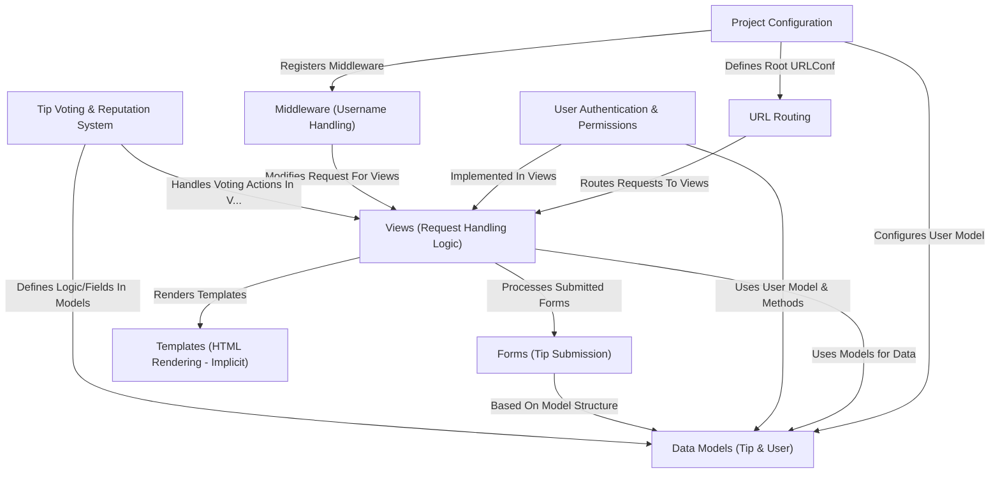

# Tutorial: Life-Pro-Tips

This project is a web application built using the **Django** framework, functioning like a simplified community board for sharing *Life Pro Tips*.
Users can post tips, **vote** on tips submitted by others (upvoting or downvoting), and build a **reputation** based on these votes.
Registered users can log in, while anonymous users are assigned temporary *Star Wars-themed* usernames. Certain actions, like downvoting or deleting, require specific reputation levels.

**Source Repository:** [https://github.com/NGdev2/Life-Pro-Tips](https://github.com/NGdev2/Life-Pro-Tips)

## Chapters

1. [Data Models (Tip & User)
](01_data_models__tip___user__.md)
2. [Views (Request Handling Logic)
](02_views__request_handling_logic__.md)
3. [URL Routing
](03_url_routing_.md)
4. [Templates (HTML Rendering - Implicit)
](04_templates__html_rendering___implicit__.md)
5. [Forms (Tip Submission)
](05_forms__tip_submission__.md)
6. [User Authentication & Permissions
](06_user_authentication___permissions_.md)
7. [Tip Voting & Reputation System
](07_tip_voting___reputation_system_.md)
8. [Project Configuration
](08_project_configuration_.md)
9. [Middleware (Username Handling)
](09_middleware__username_handling__.md)

---

Generated by [AI Codebase Knowledge Builder](https://github.com/The-Pocket/Tutorial-Codebase-Knowledge)